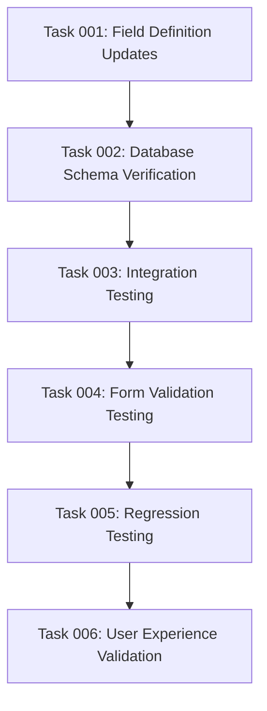

# Plan: Fix Auto-Detect Form Validation for Native App Override Fields

## Original Work Order

""Enhanced PKCE" and "Native App Override" cannot be set to auto-detect in the consumer form. This is because those are required (to avoid having "\_none" value) but the autodetect value is set to `''`."

## Executive Summary

This plan addresses a critical form validation issue in the Simple OAuth Native Apps module where two key fields ("Enhanced PKCE" and "Native App Override") cannot be set to their auto-detect options. The fields are marked as required in their base field definitions but use empty string values for auto-detection, causing Drupal's form validation to reject the submissions. This prevents users from utilizing the intelligent auto-detection features that are core to the module's functionality.

The solution involves modifying the base field definitions to remove the required constraint, allowing empty string values for auto-detection while maintaining data integrity through proper default values and logical validation. This will restore the intended user experience where auto-detection is the default and preferred option.

## Context

### Current State

The Simple OAuth Native Apps module extends Simple OAuth with RFC 8252 compliance for native applications. Two critical fields in the consumer form are currently broken:

1. **Native App Override** (`native_app_override` field):
   - Purpose: Allows manual override of automatic client type detection
   - Current issue: Marked as `setRequired(TRUE)` but uses `''` for auto-detect option
   - Impact: Users cannot select "Automatic detection" option

2. **Enhanced PKCE** (`native_app_enhanced_pkce` field):
   - Purpose: Controls enhanced PKCE requirements for specific consumers
   - Current issue: Marked as `setRequired(TRUE)` but uses `''` for auto-determine option
   - Impact: Users cannot select "Automatic determination" option

Both fields are defined in `/var/www/html/web/modules/contrib/simple_oauth_21/modules/simple_oauth_native_apps/simple_oauth_native_apps.module` lines 160-205.

### Target State

After successful implementation:

- Users can select auto-detect/auto-determine options for both fields
- Form validation passes successfully with empty string values for auto-detection
- Default behavior remains automatic detection as intended by the module design
- Data integrity is maintained through proper default values
- No breaking changes to existing consumer configurations

### Background

The module was designed with intelligent auto-detection as the primary user experience. The required constraint was likely added to prevent "\_none" values but inadvertently blocked the intended auto-detection functionality. This represents a UX regression where the most user-friendly option (automatic behavior) became unusable.

## Technical Implementation Approach

### Component 1: Base Field Definition Modifications

**Objective**: Remove required constraints from auto-detection fields while maintaining data integrity

The core fix involves modifying the BaseFieldDefinition configurations in `simple_oauth_native_apps.module`:

1. **Remove Required Constraints**: Change `setRequired(TRUE)` to `setRequired(FALSE)` for both fields
2. **Preserve Default Values**: Maintain `setDefaultValue('')` to ensure auto-detection is the default
3. **Validate Allowed Values**: Confirm that empty string options remain in the allowed values arrays
4. **Update Field Descriptions**: Clarify that empty/auto options are preferred defaults

### Component 2: Database Schema Update

**Objective**: Ensure existing consumer entities handle the field changes correctly

Since the fields will no longer be required, we need to:

1. **Schema Consistency**: Verify that existing consumers with empty values continue to work
2. **Migration Safety**: Ensure no data loss during the field definition updates
3. **Default Value Handling**: Confirm that new consumers get appropriate defaults

### Component 3: Form Integration Validation

**Objective**: Verify that form alterations and validation logic work with non-required fields

The module uses both base field definitions and form alterations. We need to ensure:

1. **Form Alter Compatibility**: ConsumerNativeAppsFormAlter.php continues to work correctly
2. **Validation Logic**: Custom validation in the form alter service handles empty values properly
3. **AJAX Functionality**: Client detection features continue to work with auto-detect options

### Component 4: Integration Testing

**Objective**: Comprehensive testing to ensure the fix doesn't break existing functionality

Testing must cover:

1. **Consumer Creation**: New consumers can be created with auto-detect options selected
2. **Consumer Editing**: Existing consumers can be modified and saved with auto-detect
3. **Auto-Detection Logic**: Native client detection continues to work properly
4. **Form Submission**: No validation errors when submitting with empty string values

## Risk Considerations and Mitigation Strategies

### Technical Risks

- **Data Validation Changes**: Removing required constraints might allow invalid data
  - **Mitigation**: Implement logical validation that accepts empty strings for auto-detection but rejects truly invalid values

- **Backward Compatibility**: Changes to field definitions might affect existing consumers
  - **Mitigation**: Test with existing consumer data and provide update hooks if necessary

### Implementation Risks

- **Module Dependencies**: Changes might affect integration with Simple OAuth PKCE module
  - **Mitigation**: Comprehensive testing of PKCE functionality with auto-detect settings

- **Form Complexity**: Multiple form alteration layers might conflict with field changes
  - **Mitigation**: Review all form alteration code to ensure compatibility

### Integration Risks

- **Auto-Detection Logic**: Native client detection might not handle empty values correctly
  - **Mitigation**: Test the NativeClientDetector service with auto-detect field values

## Success Criteria

### Primary Success Criteria

1. Users can successfully select and save "Automatic detection" for Native App Override field
2. Users can successfully select and save "Automatic determination" for Enhanced PKCE field
3. Form validation passes without errors when auto-detect options are selected
4. New consumers default to auto-detect behavior as intended

### Quality Assurance Metrics

1. All existing automated tests continue to pass after modifications
2. Manual testing confirms auto-detection features work as expected
3. No regression in native client type detection functionality
4. Form submission performance remains unchanged

## Resource Requirements

### Development Skills

- Drupal entity system and base field definitions
- Form API and validation patterns
- Simple OAuth module architecture understanding
- PHPUnit testing for regression prevention

### Technical Infrastructure

- Local development environment with Simple OAuth Native Apps module
- Test consumers with various native app configurations
- Browser testing capability for form interaction validation

## Integration Strategy

The changes integrate with existing Simple OAuth ecosystem components:

- **Simple OAuth Core**: No changes required to base OAuth functionality
- **Simple OAuth PKCE**: Enhanced PKCE detection logic should continue working with auto-detect
- **Simple OAuth Client Registration**: Dynamic registration should respect auto-detect settings
- **Simple OAuth Server Metadata**: Metadata generation should reflect proper auto-detection capabilities

## Implementation Order

1. **Field Definition Updates**: Modify base field definitions to remove required constraints
2. **Database Schema Verification**: Ensure schema changes don't break existing data
3. **Integration Testing**: Verify auto-detection logic works with non-required fields
4. **Form Validation Testing**: Confirm form submission works with empty string auto-detect values
5. **Regression Testing**: Run full test suite to ensure no functionality breaks
6. **User Experience Validation**: Manual testing of the complete consumer creation/editing workflow

## Task Dependency Visualization

## Execution Blueprint

**Validation Gates:**

- Reference: `@.ai/task-manager/config/hooks/POST_PHASE.md`

### Phase 1: Core Implementation

**Parallel Tasks:**

- Task 001: Field Definition Updates

### Phase 2: Verification and Basic Testing

**Parallel Tasks:**

- Task 002: Database Schema Verification (depends on: 001)

### Phase 3: Integration and Logic Testing

**Parallel Tasks:**

- Task 003: Integration Testing (depends on: 002)

### Phase 4: Comprehensive Validation

**Parallel Tasks:**

- Task 004: Form Validation Testing (depends on: 003)

### Phase 5: Quality Assurance

**Parallel Tasks:**

- Task 005: Regression Testing (depends on: 004)

### Phase 6: User Experience Validation

**Parallel Tasks:**

- Task 006: User Experience Validation (depends on: 005)

### Post-phase Actions

After completing all phases:

- Document any field description improvements identified during UX validation
- Update module documentation if auto-detect behavior changes user guidance
- Consider creating update hooks if field changes require database updates
- Verify integration with Simple OAuth Client Registration module

### Execution Summary

- Total Phases: 6
- Total Tasks: 6
- Maximum Parallelism: 1 task per phase (sequential execution due to dependencies)
- Critical Path Length: 6 phases

## Notes

- The original required constraint was likely intended to prevent "\_none" values, but auto-detection (empty string) is different from "\_none" and should be allowed
- This fix aligns with the module's design philosophy of intelligent defaults and automatic behavior
- The change should be minimally invasive, affecting only the field definitions while preserving all detection logic
