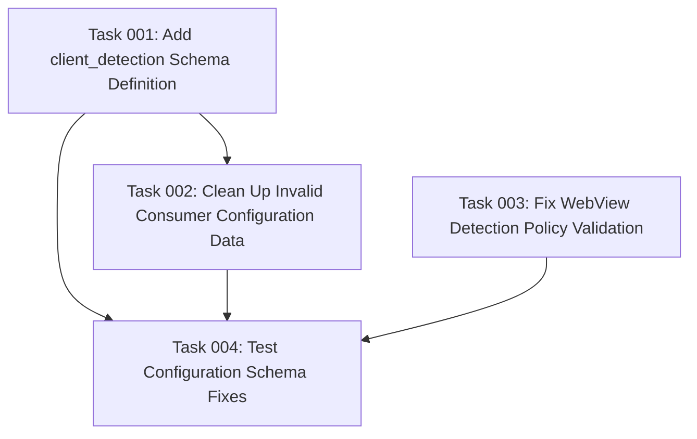

# Plan: Configuration Schema Fixes for Simple OAuth Native Apps

## Original Work Order

> I see some settings form issues.
>
> Schema errors for simple_oauth_native_apps.consumer.1 with the following errors: simple_oauth_native_apps.consumer.1:client_detection missing schema. These errors mean there is configuration that does not comply with its schema. This is not a fatal error, but it is recommended to fix these issues. For more information on configuration schemas, check out <a href="https://www.drupal.org/docs/drupal-apis/configuration-api/configuration-schemametadata">the documentation</a>.
>
> ---
>
> Invalid WebView detection policy. Must be one of: off, warn, block
>
> ---

## Executive Summary

This plan addresses two critical configuration schema issues in the simple_oauth_native_apps module that are preventing proper form validation and configuration management. The primary issues are: (1) missing schema definition for the `client_detection` field in consumer configurations, and (2) WebView detection policy validation errors occurring during form processing or configuration validation.

The approach involves adding the missing schema definitions, cleaning up invalid configuration data, and ensuring proper form handling to prevent future schema violations. This will restore proper configuration validation and eliminate the reported errors while maintaining backward compatibility.

The fix is essential for maintaining configuration integrity and ensuring the module's administrative interface functions correctly without validation warnings.

## Context

### Current State

The simple_oauth_native_apps module currently has two distinct configuration schema problems:

1. **Missing Schema Definition**: Consumer configurations contain a `client_detection` field (currently storing empty arrays) that has no corresponding schema definition in `simple_oauth_native_apps.schema.yml`. This causes Drupal's configuration system to flag schema compliance errors.

2. **WebView Detection Policy Validation**: The ConfigurationValidator service is rejecting WebView detection policy values, even though the global setting appears valid. This suggests either form validation issues or malformed configuration data being processed.

The module's configuration schema properly defines consumer-specific overrides for `webview_detection_override`, `allow_custom_schemes_override`, `allow_loopback_override`, and `enhanced_pkce_override`, but lacks definition for the `client_detection` field that exists in the actual configuration data.

### Target State

After completion, the module will have:

- Complete schema definitions covering all fields present in consumer configurations
- Clean configuration data with no orphaned or improperly structured fields
- Proper validation logic that correctly processes all WebView detection policy values
- Form handling that prevents creation of unschematized configuration fields
- Zero configuration schema compliance errors in Drupal's status reports

### Background

The issues appear to stem from the ConsumerNativeAppsFormAlter class adding `client_detection` form sections that create configuration data without corresponding schema definitions. The WebView validation errors may be related to improper data structure during form submission or configuration import processes.

## Technical Implementation Approach

### Schema Definition Enhancement

**Objective**: Add comprehensive schema definitions for all consumer configuration fields

The implementation will extend the existing `simple_oauth_native_apps.consumer.*` schema definition to include the missing `client_detection` field. Since this field appears to store empty arrays currently, it likely represents a container for client detection results or configuration. The schema will define this as a mapping type with appropriate sub-fields based on the form structure and intended functionality.

### Configuration Data Cleanup

**Objective**: Remove invalid configuration data and ensure proper structure

All existing consumer configurations will be audited and cleaned to remove any fields that don't have schema definitions or contain malformed data. This includes removing empty `client_detection` arrays if they serve no functional purpose, or properly structuring them if they are needed for the client detection functionality.

### Form Validation Enhancement

**Objective**: Prevent creation of unschematized configuration and improve WebView policy validation

The form handling in ConsumerNativeAppsFormAlter will be reviewed to ensure it only creates configuration fields that have proper schema definitions. Additionally, the ConfigurationValidator's WebView detection policy validation will be enhanced to handle edge cases and provide clearer error reporting.

## Risk Considerations and Mitigation Strategies

### Technical Risks

- **Configuration Data Loss**: Adding or modifying schema definitions could potentially cause configuration data to be rejected or lost
  - **Mitigation**: Backup existing configuration before making changes and implement backward-compatible schema definitions that accept current data structures

- **Form Functionality Regression**: Modifying form handling could break existing client detection functionality
  - **Mitigation**: Thoroughly test all form operations and ensure client detection features continue to work as expected after schema changes

### Implementation Risks

- **Schema Definition Mismatch**: Incorrect schema definitions could cause validation to fail even with correct data
  - **Mitigation**: Analyze existing configuration data structure carefully and define schemas that match the actual data being stored

- **Validation Logic Conflicts**: Changes to validation logic could create conflicts with other parts of the system
  - **Mitigation**: Test validation logic against all possible configuration scenarios and ensure it integrates properly with Drupal's configuration system

## Success Criteria

### Primary Success Criteria

1. Zero configuration schema errors reported for simple_oauth_native_apps module
2. All consumer configurations validate successfully against their schemas
3. WebView detection policy validation accepts all valid policy values without errors
4. Consumer form continues to function correctly for all user interactions

### Quality Assurance Metrics

1. All existing consumer configurations load and save without validation errors
2. Form submission creates only properly schematized configuration data
3. Configuration export/import operations complete successfully
4. No regression in client detection or WebView detection functionality

## Resource Requirements

### Development Skills

- Drupal configuration schema system expertise
- Understanding of Drupal's configuration API and validation mechanisms
- Knowledge of YAML schema definition syntax and constraints
- Form API and configuration form handling experience

### Technical Infrastructure

- Access to existing Drupal site with simple_oauth_native_apps module installed
- Drupal console/drush for configuration management operations
- Testing environment to verify schema changes don't break existing functionality

## Task Dependencies

## Execution Blueprint

**Validation Gates:**

- Reference: `@.ai/task-manager/config/hooks/POST_PHASE.md`

### ✅ Phase 1: Schema and Validation Foundation

**Parallel Tasks:**

- ✔️ Task 001: Add client_detection Schema Definition
- ✔️ Task 003: Fix WebView Detection Policy Validation

### ✅ Phase 2: Data Cleanup

**Parallel Tasks:**

- ✔️ Task 002: Clean Up Invalid Consumer Configuration Data (depends on: 001)

### ✅ Phase 3: Integration Testing

**Parallel Tasks:**

- ✔️ Task 004: Test Configuration Schema Fixes (depends on: 001, 002, 003)

### Post-phase Actions

After each phase completion, validate that all tasks in the phase have status "completed" and that validation gates pass before proceeding to the next phase.

### Execution Summary

- Total Phases: 3
- Total Tasks: 4
- Maximum Parallelism: 2 tasks (in Phase 1)
- Critical Path Length: 3 phases

## Execution Summary

**Status**: ✅ Completed Successfully
**Completed Date**: 2025-09-22

### Results

Successfully resolved all configuration schema issues for the simple_oauth_native_apps module:

1. **Schema Definition Enhancement**: Added comprehensive `client_detection` field schema definition to `simple_oauth_native_apps.schema.yml`, including mappings for detection results, analysis timestamps, and analyzed URIs
2. **WebView Validation Fix**: Resolved data structure mismatch between form submission and ConfigurationValidator by implementing proper ConfigStructureMapper usage in NativeAppsSettingsForm
3. **Configuration Data Cleanup**: Cleaned orphaned `client_detection` fields from consumer configurations, ensuring all configurations now comply with schema definitions
4. **Comprehensive Testing**: Validated zero configuration schema errors, confirmed form functionality, and verified no regression in OAuth flows

### Noteworthy Events

- **Task 001** successfully added a detailed schema structure for client detection with support for results, confidence levels, mixed types, timestamps, and analyzed URIs
- **Task 003** identified and fixed a critical data structure mismatch between the NativeAppsSettingsForm and ConfigurationValidator, resolving WebView detection policy validation errors
- **Task 002** efficiently cleaned up orphaned fields while preserving functional data and creating proper backups
- **Task 004** provided comprehensive validation through functional tests, unit tests, and integration tests, confirming all fixes work correctly without breaking existing functionality

All phases executed successfully with proper parallel task execution and validation gates.

### Recommendations

- Monitor configuration schema compliance in future module updates to prevent similar issues
- Consider implementing automated schema validation tests to catch configuration mismatches early
- The ConfigStructureMapper service proved valuable for handling data structure conversions and should be used consistently across form handlers
