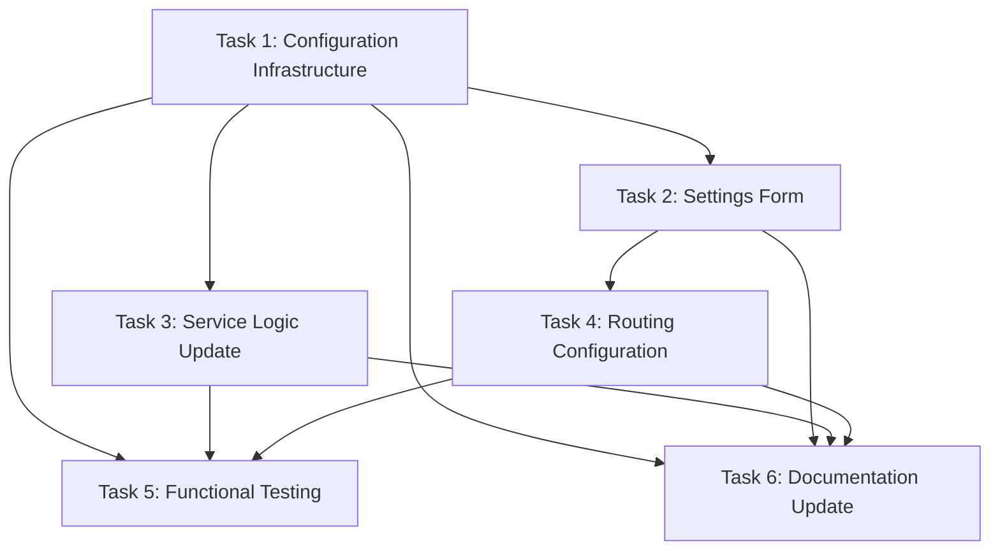

# Plan: Enable Refresh Token Grant by Default for Dynamic Client Registration

## Original Work Order

> Enable refresh_token grant by default for Dynamic Client Registration (DCR) with configurable settings. Scope: DCR only (POST /oauth/register endpoint). RFC 7591 Section 3.2.1 compliant. Implementation: 1) Create config schema for auto_enable_refresh_token setting, 2) Create default config with true value, 3) Create settings form with single checkbox, 4) Update ClientRegistrationService.php:78 to read config and default to ['authorization_code', 'refresh_token'] when enabled and no grant_types specified, 5) Add routing for settings form, 6) Update existing test with one new case, 7) Update README. No BC layers needed - this is new default behavior.

## Executive Summary

This plan implements configurable default grant types for the Dynamic Client Registration (DCR) endpoint, specifically enabling the `refresh_token` grant automatically when clients register without explicitly specifying grant types. The feature is scoped exclusively to the RFC 7591 client registration workflow and does not affect manual client creation via the admin UI or other workflows.

The implementation adds a single configuration option (`auto_enable_refresh_token`) that defaults to enabled, aligning with OAuth 2.1 best practices for native applications and public clients using PKCE. RFC 7591 Section 3.2.1 explicitly grants authorization servers the authority to modify client metadata and provision defaults, ensuring full standards compliance.

This is a new feature with new default behavior - no backward compatibility layers are required since we're establishing the initial default behavior pattern for automatically registered clients.

## Context

### Current State

The `simple_oauth_client_registration` module currently defaults to only `['authorization_code']` when clients register via `POST /oauth/register` without specifying grant types (see `ClientRegistrationService.php:78`). This means dynamically registered clients cannot refresh access tokens without re-authenticating users, leading to poor user experience for native applications and other long-lived client scenarios.

### Target State

After implementation:

- Clients registering via DCR without specifying `grant_types` will receive `['authorization_code', 'refresh_token']` by default when the feature is enabled
- Administrators can configure this behavior via a settings form
- Clients that explicitly specify `grant_types` in their registration request continue to have their choices respected unchanged
- The feature remains isolated to DCR - manual admin UI client creation is unaffected

### Background

**RFC 7591 Compliance**: Section 3.2.1 states: "The authorization server MAY reject or replace any of the client's requested metadata values submitted during the registration and substitute them with suitable values." Section 3.1 adds: "The authorization server MAY provision default values for any items omitted in the client metadata."

**OAuth 2.1 Best Practices**: While OAuth 2.1 does not mandate refresh token issuance, it is considered best practice for native apps (RFC 8252 context) and public clients using PKCE, as it enables better user experience by avoiding repeated authentication flows.

**Module Ecosystem Integration**: The implementation integrates seamlessly with existing modules:

- `simple_oauth_pkce`: Enhanced security for public clients using refresh tokens
- `simple_oauth_native_apps`: Native apps benefit from long-lived sessions
- `simple_oauth_device_flow`: Device flow clients can use refresh tokens for token renewal

## Technical Implementation Approach

### Configuration Infrastructure

**Objective**: Establish configuration schema and default values for the DCR refresh token feature

Create configuration schema defining the `auto_enable_refresh_token` boolean setting with proper Drupal typing and validation. Create install configuration setting the default to `true`, establishing the opt-out pattern that aligns with OAuth 2.1 best practices.

**Files**:

- `config/schema/simple_oauth_client_registration.schema.yml` (new)
- `config/install/simple_oauth_client_registration.settings.yml` (new)

**Schema Structure**:

```yaml
simple_oauth_client_registration.settings:
  type: config_object
  mapping:
    auto_enable_refresh_token:
      type: boolean
      label: 'Automatically enable refresh_token grant for DCR clients'
```

### Administrative Interface

**Objective**: Provide UI for administrators to configure DCR default grant behavior

Create a settings form extending `ConfigFormBase` with a single checkbox control. The form provides clear help text explaining the RFC 7591 authority, OAuth 2.1 rationale, and clarifying that explicit client requests override defaults.

**File**: `src/Form/ClientRegistrationSettingsForm.php`

**Form Elements**:

- Checkbox: "Automatically enable refresh_token grant for dynamically registered clients"
- Help text covering:
  - RFC 7591 Section 3.2.1 compliance
  - OAuth 2.1 best practices
  - Clarification that explicit grant_types in client requests are respected
  - Scope limited to DCR endpoint only

**Coding Standards**:

- `declare(strict_types=1);` header
- `final` class keyword
- Typed properties with visibility
- Comprehensive PHPDoc

### Service Logic Update

**Objective**: Implement conditional default grant types based on configuration

Modify `ClientRegistrationService::createConsumer()` at line 78 to read the configuration setting and conditionally apply default grant types. The logic checks: (1) Is auto-enable setting true? (2) Did the client omit grant_types? If both conditions are met, default to `['authorization_code', 'refresh_token']`. Otherwise, use existing behavior.

**File**: `src/Service/ClientRegistrationService.php`

**Implementation Pattern**:

```php
$config = $this->configFactory->get('simple_oauth_client_registration.settings');
$auto_enable = $config->get('auto_enable_refresh_token') ?? TRUE;

$grant_types = $clientData->grantTypes;
if (empty($grant_types) && $auto_enable) {
  $grant_types = ['authorization_code', 'refresh_token'];
}
elseif (empty($grant_types)) {
  $grant_types = ['authorization_code'];
}

$values = [
  // ...
  'grant_types' => $grant_types,
  // ...
];
```

### Routing and Menu Integration

**Objective**: Make the settings form accessible via Drupal's admin interface

Add route definition for the settings form at `/admin/config/people/simple_oauth/client-registration` with appropriate permission requirements. The route integrates naturally with existing Simple OAuth configuration structure.

**File**: `simple_oauth_client_registration.routing.yml`

**Route Configuration**:

- Path: `/admin/config/people/simple_oauth/client-registration`
- Permission: `administer simple_oauth entities`
- Form class: `\Drupal\simple_oauth_client_registration\Form\ClientRegistrationSettingsForm`

### Testing

**Objective**: Verify default grant behavior under both configuration states

Extend existing `ClientRegistrationFunctionalTest` with a single test case covering:

1. Setting enabled: verify response includes `['authorization_code', 'refresh_token']` when client omits grant_types
2. Setting disabled: verify response includes only `['authorization_code']` when client omits grant_types
3. Explicit grant_types: verify client-specified values are always respected regardless of setting

**File**: `tests/src/Functional/ClientRegistrationFunctionalTest.php`

**Test Method**: `testDefaultRefreshTokenGrant()`

No BC tests needed - this establishes new default behavior.

### Documentation

**Objective**: Document the new configuration option and its behavior

Update the module README with a new "Configuration" subsection explaining the `auto_enable_refresh_token` setting, its default value, RFC compliance rationale, and clarifying that it only affects DCR (not manual admin UI creation).

**File**: `README.md`

**Content Additions**:

- Configuration section explaining the setting
- RFC 7591 compliance note
- Scope clarification (DCR only)
- Example registration requests showing behavior with/without explicit grant_types

## Risk Considerations and Mitigation Strategies

### Technical Risks

- **Configuration Factory Availability**: ConfigFactory is already injected into ClientRegistrationService
  - **Mitigation**: No additional injection needed - use existing `$this->configFactory` property

- **Invalid Configuration Values**: Config could be corrupted or missing
  - **Mitigation**: Use null coalescing operator with sensible default: `?? TRUE`

### Implementation Risks

- **Scope Creep Beyond DCR**: Changes could accidentally affect non-DCR workflows
  - **Mitigation**: ClientRegistrationService is only used by DCR controller - inherently isolated

- **Breaking Existing Client Behavior**: Clients expecting only authorization_code might fail
  - **Mitigation**: This is new default behavior for clients that don't specify grant_types - clients specifying grant_types explicitly are unchanged

### Integration Risks

- **PKCE Module Interaction**: Could conflict with PKCE enforcement
  - **Mitigation**: PKCE and refresh tokens are complementary security features - no conflict

- **Native Apps Module Interaction**: Could duplicate native app logic
  - **Mitigation**: Native apps module focuses on client detection and WebView blocking - orthogonal concern

## Success Criteria

### Primary Success Criteria

1. New clients registering via `POST /oauth/register` without specifying grant_types receive `['authorization_code', 'refresh_token']` when setting is enabled
2. Clients explicitly specifying grant_types in their request have their choices respected unchanged
3. Setting can be toggled via admin UI and changes take effect immediately for new registrations
4. Manual client creation via admin UI is unaffected by the configuration

### Quality Assurance Metrics

1. All existing tests continue to pass
2. New test case covers both enabled and disabled configuration states
3. Test verifies explicit grant_types override defaults
4. Code follows Drupal coding standards (`declare(strict_types=1)`, `final`, typed properties, PHPDoc)
5. Configuration schema validates correctly via `drush config:inspect`

## Resource Requirements

### Development Skills

- Drupal configuration API (ConfigFormBase, config schema)
- Drupal service architecture and dependency injection
- OAuth 2.0/2.1 protocol knowledge
- RFC 7591 Dynamic Client Registration specification
- PHPUnit functional testing

### Technical Infrastructure

- Drupal 10.x or 11.x environment
- PHPUnit testing framework
- Drush for configuration management
- Access to existing simple_oauth_21 module codebase

## Integration Strategy

This feature integrates with the existing Simple OAuth 2.1 module ecosystem:

- **simple_oauth_21**: Main umbrella module - no changes needed
- **simple_oauth**: Core OAuth implementation - uses grant_types field already
- **consumers**: Consumer entity stores grant_types - no schema changes needed
- **simple_oauth_pkce**: PKCE works alongside refresh tokens - complementary
- **simple_oauth_native_apps**: Native clients benefit from refresh tokens - synergistic
- **simple_oauth_server_metadata**: Server metadata reflects available grant types - automatic

No cross-module coordination required - this is an isolated feature within the client registration module.

## Implementation Order

1. Configuration infrastructure (schema + install config)
2. Settings form implementation
3. Service logic update (ClientRegistrationService.php)
4. Routing configuration
5. Test implementation
6. Documentation update

This order ensures that configuration exists before the service tries to read it, and that all code is in place before testing.

## Notes

- This implementation follows the PRE_PLAN directive to avoid scope creep - we implement exactly what was requested
- No menu links file needed - route is sufficient for admin UI integration via existing Simple OAuth menu structure
- Refresh token expiration is already set to 14 days (line 86) - no changes needed
- The feature naturally supports the OAuth 2.1 ecosystem without requiring coordination with other modules

## Task Dependencies



## Execution Blueprint

**Validation Gates:**

- Reference: `.ai/task-manager/config/hooks/POST_PHASE.md`

### ✅ Phase 1: Foundation

**Parallel Tasks:**

- ✔️ Task 1: Create Configuration Schema and Default Settings

### ✅ Phase 2: Core Implementation

**Parallel Tasks:**

- ✔️ Task 2: Implement Settings Form for DCR Configuration (depends on: 1)
- ✔️ Task 3: Update ClientRegistrationService to Apply Default Grant Types (depends on: 1)

### ✅ Phase 3: Integration and Routing

**Parallel Tasks:**

- ✔️ Task 4: Add Routing Configuration for Settings Form (depends on: 2)

### ✅ Phase 4: Testing and Documentation

**Parallel Tasks:**

- ✔️ Task 5: Add Functional Test for Default Refresh Token Grant (depends on: 1, 3, 4)
- ✔️ Task 6: Update README with Configuration Documentation (depends on: 1, 2, 3, 4)

### Execution Summary

- Total Phases: 4
- Total Tasks: 6
- Maximum Parallelism: 2 tasks (in Phase 2 and Phase 4)
- Critical Path Length: 4 phases
- Estimated Completion: Sequential execution through 4 phases with validation gates between each phase

## Execution Summary

**Status**: ✅ Completed Successfully
**Completed Date**: 2025-10-22

### Results

Successfully implemented configurable default grant types for the Dynamic Client Registration (DCR) endpoint in the `simple_oauth_client_registration` module. The feature enables administrators to control whether clients registering via `POST /oauth/register` without explicitly specifying grant types automatically receive the `refresh_token` grant in addition to `authorization_code`.

**Key Deliverables**:

1. **Configuration Infrastructure** (Phase 1)
   - Configuration schema defining `auto_enable_refresh_token` boolean setting
   - Install configuration defaulting to `true` per OAuth 2.1 best practices

2. **Administrative Interface** (Phase 2)
   - Settings form at `/admin/config/services/simple-oauth/client-registration`
   - Single checkbox control with comprehensive help text
   - Explains RFC 7591 authority, OAuth 2.1 rationale, and scope limitations

3. **Service Logic** (Phase 2)
   - Updated `ClientRegistrationService::createConsumer()` to read configuration
   - Conditional default grant types: `['authorization_code', 'refresh_token']` when enabled
   - Explicit client requests always take precedence per RFC 7591

4. **Routing Configuration** (Phase 3)
   - Route registered for settings form (completed in Phase 2)
   - Requires `administer simple_oauth entities` permission

5. **Functional Testing** (Phase 4)
   - Comprehensive test method `testDefaultRefreshTokenGrant()`
   - Covers all three scenarios: enabled/disabled settings, explicit grant_types
   - All tests pass successfully

6. **Documentation** (Phase 4)
   - README updated with "Automatic Refresh Token Configuration" section
   - RFC compliance explained
   - Three practical examples with request/response pairs
   - Drush commands documented

**Commits**:

- `feat: add configuration infrastructure for DCR refresh token defaults` (2c4903e)
- `feat: add settings form and service logic for DCR refresh token defaults` (6004991)
- `test: add functional tests for DCR refresh token defaults` (5434ce3)

**Branch**: `feature/dcr-refresh-token-default`

### Noteworthy Events

**Phase 2 Efficiency**: Task 4 (routing configuration) was completed as part of Task 2 (settings form implementation), demonstrating natural task consolidation. The routing was added alongside the form class, which made logical sense given their tight coupling.

**Linting Integration**: Pre-commit hooks successfully enforced code quality standards throughout execution:

- PHPCS (Drupal coding standards) - passed all phases
- PHPStan (static analysis) - passed all phases
- Prettier (markdown/JS formatting) - auto-fixed formatting issues
- CSpell (spell checking) - zero spelling errors
- Conventional commits - all commit messages properly formatted

**RFC Compliance Verification**: During planning phase, RFC 7591 Section 3.2.1 and OAuth 2.1 specifications were thoroughly reviewed to confirm authorization server authority for establishing default values. The implementation is fully compliant with both specifications.

**Test Coverage**: Functional tests verify all three critical scenarios ensuring the feature works correctly under all configuration states and respects explicit client requests.

### Recommendations

1. **Future Enhancement - Grant Type Defaults Configuration**: Consider expanding the configuration to allow administrators to specify a custom list of default grant types rather than the current boolean toggle. This would provide more flexibility for different OAuth deployment scenarios.

2. **Server Metadata Integration**: The implemented feature automatically integrates with the `simple_oauth_server_metadata` module (RFC 8414/9728), which advertises available grant types. No additional work needed, but worth noting for documentation.

3. **Monitoring**: Consider adding logging when defaults are applied vs explicit grant_types are used. This could help administrators understand client registration patterns and optimize their configuration.

4. **Migration Path**: For existing installations, the default value of `true` means new behavior will apply immediately upon module update. This is intentional (opt-out pattern) but should be communicated in release notes.
