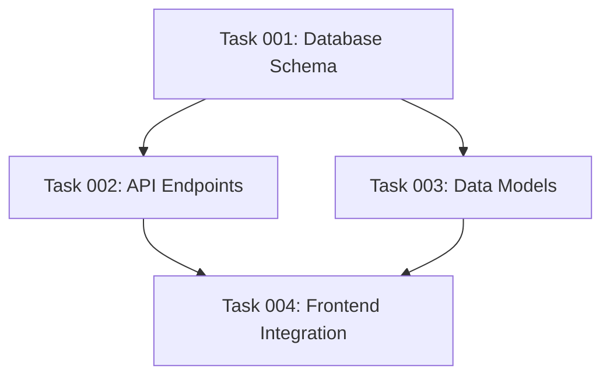

# POST_PLAN Hook

This hook provides validation and update procedures to execute after plan creation, ensuring comprehensive context analysis and proper plan document structuring with dependency visualization.

## Plan Validation and Clarification

#### Step 1: Context Analysis

Before creating any plan, analyze the user's request for:

- **Objective**: What is the end goal?
- **Scope**: What are the boundaries and constraints?
- **Resources**: What tools, budget, or team are available?
- **Success Criteria**: How will success be measured?
- **Dependencies**: What prerequisites or blockers exist?
- **Technical Requirements**: What technologies or skills are needed?

#### Step 2: Clarification Phase

If any critical context is missing:

1. Identify specific gaps in the information provided
2. Ask targeted follow-up questions grouped by category
3. Wait for user responses before proceeding to planning
4. Frame questions clearly with examples when helpful
5. Be extra cautious. Users miss important context very often. Don't hesitate to ask for clarifications.

Example clarifying questions:

- "Q: What is your primary goal with [specific aspect]?"
- "Q: Do you have any existing [resources/code/infrastructure] I should consider?"
- "Q: What is your timeline for completing this?"
- "Q: Are there specific constraints I should account for?"
- "Q: Do you want me to write tests for this?"
- "Q: Are there other systems, projects, or modules that perform a similar task?"

Try to answer your own questions first by inspecting the codebase, docs, and assistant documents like CLAUDE.md, GEMINI.md, AGENTS.md ...

## Update the plan document

After creating all tasks with their dependencies, update the original plan document with two critical sections: a task dependency visualization and a phase-based execution blueprint.

### Section 1: Dependency Visualization

If any tasks have dependencies, create a Mermaid diagram showing the dependency graph:



Note: Ensure the graph is acyclic (no circular dependencies).

### Section 2: Phase-Based Execution Blueprint

#### Core Concept

The execution blueprint organizes tasks into sequential phases where:

- **Within a phase**: All tasks execute in parallel
- **Between phases**: Execution is strictly sequential
- **Phase progression**: Requires all tasks in current phase to complete AND validation gates to pass

#### Phase Definition Rules

1. **Phase 1**: Contains all tasks with zero dependencies
2. **Phase N**: Contains tasks whose dependencies are ALL satisfied by tasks in phases 1 through N-1
3. **Parallelism Priority**: Maximize the number of tasks that can run simultaneously in each phase
4. **Completeness**: Every task must be assigned to exactly one phase

#### Blueprint Structure

```markdown
## Execution Blueprint

**Validation Gates:**

- Reference: `@.ai/task-manager/config/hooks/POST_PHASE.md`

### Phase 1: [Descriptive Phase Name]

**Parallel Tasks:**

- Task 001: [Description]
- Task 005: [Description]
- Task 009: [Description]

### Phase 2: [Descriptive Phase Name]

**Parallel Tasks:**

- Task 002: [Description] (depends on: 001)
- Task 003: [Description] (depends on: 001)
- Task 006: [Description] (depends on: 005)

[Continue for all phases...]

### Post-phase Actions

### Execution Summary

- Total Phases: X
- Total Tasks: Y
- Maximum Parallelism: Z tasks (in Phase N)
- Critical Path Length: X phases
```

### Validation Requirements

#### Phase Transition Rules

1. All tasks in the current phase must have status: "completed"
2. All validation gates defined in `@.ai/task-manager/config/hooks/POST_PHASE.md` for the current phase must pass
3. No task in a future phase can begin until these conditions are met

#### Blueprint Verification

Before finalizing, ensure:

- [ ] Every task appears in exactly one phase
- [ ] No task appears in a phase before all its dependencies
- [ ] Phase 1 contains only tasks with no dependencies
- [ ] Each phase maximizes parallel execution opportunities
- [ ] All phases reference their validation gates
- [ ] The execution summary accurately reflects the blueprint

### Important Notes

#### Parallel Execution

- Tasks within a phase have no interdependencies and can run simultaneously
- This enables efficient resource utilization and faster completion
- AI agents can be assigned to multiple tasks within the same phase

#### Sequential Phases

- Phases execute in strict numerical order
- Phase N+1 cannot begin until Phase N is fully complete and validated
- This ensures dependency integrity and systematic progress
-

#### Validation Gates

- Each phase has associated validation criteria defined externally
- Gates ensure quality and correctness before progression
- Failed validations require task remediation before phase completion

### Error Handling

If dependency analysis reveals issues:

- **Circular dependencies**: Document the cycle and mark affected tasks for review
- **Orphaned tasks**: Tasks that cannot be scheduled due to missing dependencies
- **Ambiguous dependencies**: Note assumptions made and flag for clarification
