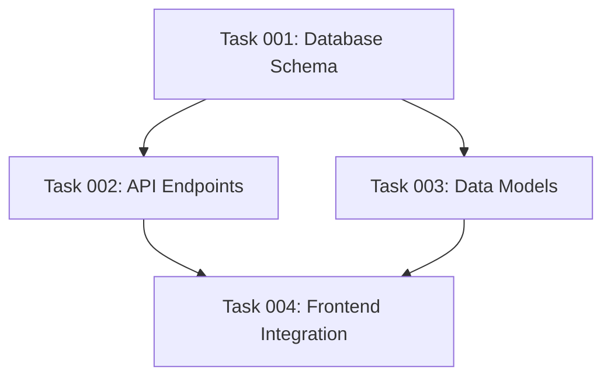

# POST_TASK_GENERATION_ALL Hook

After all tasks have been generated use your internal Todo task to execute:

- [ ] Complexity Analysis & Refinement
- [ ] Update plan document with Blueprint information

## Complexity Analysis & Refinement

### Complexity Scoring Matrix (1-10 scale)

| Dimension | 1-2 | 3-4 | 5-6 | 7-8 | 9-10 |
|-----------|-----|-----|-----|-----|------|
| **Technical** | Basic ops | Single tech | 2-3 techs | Multiple complex | Cutting-edge |
| **Decision** | No decisions | 1-2 minor | Trade-offs | Interdependent | Novel solutions |
| **Integration** | Single file | 2-3 files | Multi-module | Many systems | 15+ services |
| **Scope** | Atomic action | Small feature | Complete feature | Major feature | Entire subsystem |
| **Uncertainty** | Crystal clear | Minor ambiguity | Some clarification | Research required | Experimental |

**Composite Score** = MAX(Technical×1.0, Decision×0.9, Integration×0.8, Scope×0.7, Uncertainty×1.1)

### Decomposition Rules

**Thresholds:**
- Composite ≥6: Consider decomposition
- Any dimension ≥8: Mandatory decomposition
- Multiple dimensions ≥6: High priority

**Patterns by Driver:**
| Driver | Pattern | Strategy |
|--------|---------|----------|
| Technical | Technology Layering | Split by tech boundaries |
| Decision | Decision-Implementation | Separate analysis from execution |
| Integration | Integration Isolation | Core feature + integrations |
| Scope | Functional | Split by user workflows |
| Uncertainty | Research-Implementation | Prototype then implement |

### AIDVR Process
1. **Assess**: Confirm need (score >5)
2. **Identify**: Find natural breakpoints
3. **Decompose**: Apply pattern
4. **Validate**: Check criteria
5. **Reconstruct**: Update dependencies

### Safety Controls

**Limits:**
- Max 3 decomposition rounds per task
- No decomposition if score ≤3
- Min 2-hour work per subtask
- Stop if complexity not decreasing

**Stop Conditions:**
1. Atomic boundary reached
2. <1 skill per subtask
3. Overhead > benefit
4. Resource fragmentation
5. <2 hour granularity
6. 3 iterations reached
7. Score ≤3
8. No complexity reduction

### Validation Checklist

**Per Subtask:**
- [ ] Complexity ≤5 (target ≤4)
- [ ] Skills ≤2
- [ ] Clear acceptance criteria
- [ ] Dependencies acyclic
- [ ] Score ≥2 (min viability)

**Decomposition Quality:**
- [ ] Coverage: All requirements included
- [ ] Coherence: Single purpose per task
- [ ] Consistency: Lower scores than parent
- [ ] Coordination: Integration plan exists

### Error Handling

| Issue | Detection | Resolution |
|-------|-----------|------------|
| Infinite loop | No reduction after 2 rounds | Stop, mark needs-clarification |
| Circular dependency | Task reaches itself | Break shortest cycle |
| Over-decomposition | Score <2 or <2hrs | Merge with sibling |
| Orphaned task | Missing dependencies | Create or remove dependency |
| Scope creep | Subtasks > original | Remove excess scope |
| Skill conflicts | >2 skills needed | Decompose by skill boundary |
| High complexity | >7 after max rounds | Escalate with documentation |

### Documentation Format

In `complexity_notes`:
```
Original: 8.2 → Round 1 → [4.1, 3.8, 4.5] → PASSED
```

**Quality Gates Before Proceeding:**
- All tasks ≤5 complexity or escalated
- No unresolved errors
- Iterations documented
- Validation complete

## Update plan document with Blueprint information

After creating all tasks with their dependencies, update the original plan document with two critical sections: a task dependency visualization and a phase-based execution blueprint.

### Section 1: Dependency Visualization

If any tasks have dependencies, create a Mermaid diagram showing the dependency graph:



Note: Ensure the graph is acyclic (no circular dependencies).

### Section 2: Phase-Based Execution Blueprint

#### Core Concept
The execution blueprint organizes tasks into sequential phases where:
- **Within a phase**: All tasks execute in parallel
- **Between phases**: Execution is strictly sequential
- **Phase progression**: Requires all tasks in current phase to complete AND validation gates to pass

#### Phase Definition Rules
1. **Phase 1**: Contains all tasks with zero dependencies
2. **Phase N**: Contains tasks whose dependencies are ALL satisfied by tasks in phases 1 through N-1
3. **Parallelism Priority**: Maximize the number of tasks that can run simultaneously in each phase
4. **Completeness**: Every task must be assigned to exactly one phase

#### Blueprint Structure

Use the template in .ai/task-manager/config/templates/BLUEPRINT_TEMPLATE.md for the execution blueprint structure.

### Validation Requirements

#### Phase Transition Rules
1. All tasks in the current phase must have status: "completed"
2. All validation gates defined in `/config/hooks/POST_PHASE.md` for the current phase must pass
3. No task in a future phase can begin until these conditions are met

#### Blueprint Verification
Before finalizing, ensure:
- [ ] Every task appears in exactly one phase
- [ ] No task appears in a phase before all its dependencies
- [ ] Phase 1 contains only tasks with no dependencies
- [ ] Each phase maximizes parallel execution opportunities
- [ ] All phases reference their validation gates
- [ ] The execution summary accurately reflects the blueprint

### Important Notes

### Error Handling

If dependency analysis reveals issues:
- **Circular dependencies**: Document the cycle and mark affected tasks for review
- **Orphaned tasks**: Tasks that cannot be scheduled due to missing dependencies
- **Ambiguous dependencies**: Note assumptions made and flag for clarification
