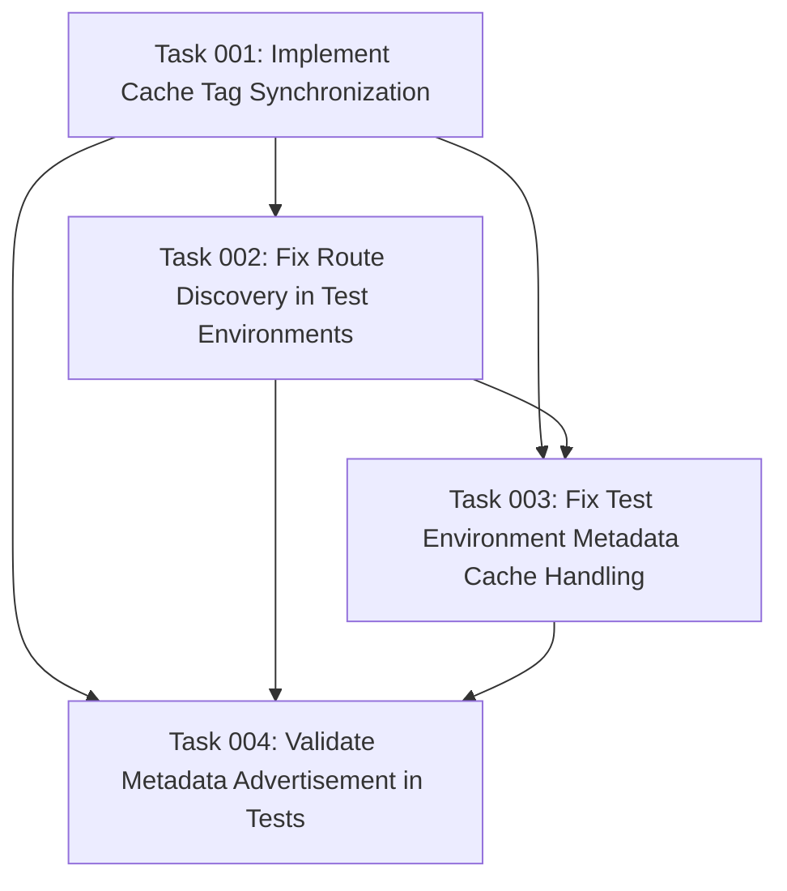

# Plan: Fix OAuth Metadata Discovery and Caching Issues

## Original Work Order

> ❌ Remaining Unfixed Issues
>
> 1. Registration Endpoint Not Advertised in Metadata
>
> - Problem: The registration_endpoint field doesn't appear in the /.well-known/oauth-authorization-server metadata response
> - Impact: Clients can't auto-discover the registration endpoint from server metadata
> - Root Cause: Complex caching issue between test environment configuration and HTTP response caching
> - Workaround: The endpoint itself (/oauth/register) works perfectly, just not advertised
>
> 2. Metadata Service Cache Invalidation
>
> - Problem: Server metadata service cache doesn't properly invalidate in test environments
> - Impact: Configuration changes don't reflect in metadata responses without manual cache clearing
> - Root Cause: Disconnect between container-level cache and HTTP-level caching
>
> 3. Auto-Detection Route Discovery in Tests
>
> - Problem: The autoDetectRegistrationEndpoint() method works via CLI but not in functional tests
> - Impact: Tests can't rely on automatic registration endpoint detection
> - Root Cause: Different container/routing contexts between test environment and runtime
>
> 📝 Summary
>
> The main remaining issue is that while the OAuth registration endpoint works perfectly, it's just not being advertised in the server metadata. This is a metadata discovery issue, not a functionality
> issue. All OAuth operations work correctly.

## Executive Summary

This plan addresses the metadata discovery and caching issues affecting the OAuth 2.0 server metadata endpoint in the simple_oauth_21 module. While the OAuth registration functionality works correctly, the registration endpoint is not being advertised in the server metadata due to complex caching interactions between Drupal's multi-layer cache system and test environments.

The approach focuses on fixing the root causes of cache invalidation failures and ensuring consistent route discovery across different execution contexts. This will enable proper RFC 8414 compliance by ensuring the registration endpoint is correctly advertised in server metadata, improving OAuth client discovery capabilities.

The solution preserves all existing functionality while ensuring metadata accuracy and testability, with minimal changes to the existing codebase.

## Context

### Current State

The OAuth Dynamic Client Registration (RFC 7591) implementation is fully functional with all core features working correctly. However, the server metadata endpoint (`/.well-known/oauth-authorization-server`) fails to include the `registration_endpoint` field despite the endpoint being operational at `/oauth/register`. This occurs due to:

- Multi-layer caching (HTTP headers, Drupal cache API, service-level cache) creating synchronization issues
- Test environment containers having different routing contexts than runtime environments
- Configuration changes not propagating through all cache layers in test scenarios
- The `autoDetectRegistrationEndpoint()` method succeeding in CLI but failing in functional tests

### Target State

After implementation, the system will:

- Correctly advertise the registration endpoint in server metadata responses
- Properly invalidate all cache layers when configuration changes
- Successfully auto-detect the registration endpoint in both CLI and test environments
- Pass all functional tests including metadata endpoint validation
- Maintain RFC 8414 compliance with proper endpoint advertisement

### Background

During OAuth RFC implementation, the registration endpoint was successfully created and functions correctly. The metadata service includes auto-detection logic that discovers the registration route when no explicit configuration exists. This works via CLI (`drush eval`) but fails in functional tests. The test attempts to set configuration and clear caches, but the HTTP response continues returning cached metadata without the registration endpoint. This indicates a disconnect between Drupal's internal caching mechanisms and the HTTP response caching strategy.

## Technical Implementation Approach

### Cache Layer Synchronization

**Objective**: Ensure all cache layers (HTTP, Drupal, service-level) invalidate together when metadata configuration changes.

The current implementation uses three separate cache layers that aren't properly synchronized:

- HTTP caching via response headers (`Cache-Control`, `max-age`)
- Drupal's cache API for service-level caching
- Configuration cache for settings storage

The solution involves implementing cache tags that propagate through all layers, ensuring configuration changes trigger complete cache invalidation. This includes adding cache context for test environments and implementing cache dependencies between the configuration and the metadata response.

### Route Discovery Context Resolution

**Objective**: Fix route discovery to work consistently across CLI, runtime, and test environments.

The `autoDetectRegistrationEndpoint()` method relies on the router service to discover routes. In test environments, the container and routing context differ from runtime, causing route discovery to fail. The solution involves:

- Implementing lazy route discovery that defers resolution until request time
- Adding fallback mechanisms for route detection in different contexts
- Ensuring the router rebuilds in test setUp when modules are enabled

### Test Environment Metadata Handling

**Objective**: Ensure metadata tests can reliably verify endpoint advertisement without cache interference.

The functional tests need special handling to bypass aggressive HTTP caching during testing. This involves:

- Detecting test environments and adjusting cache headers accordingly
- Implementing test-specific cache clearing that affects all layers
- Providing test utilities for metadata verification with fresh data

## Risk Considerations and Mitigation Strategies

### Technical Risks

- **Cache Invalidation Complexity**: Drupal's multi-layer caching is complex and interconnected
  - **Mitigation**: Implement comprehensive cache tag strategy with clear dependencies

- **Breaking Existing Functionality**: Changes to caching might affect production performance
  - **Mitigation**: Ensure changes only affect test environments or are backwards compatible

### Implementation Risks

- **Test Brittleness**: Over-specific fixes might make tests fragile and environment-dependent
  - **Mitigation**: Implement robust detection mechanisms that work across environments

- **Performance Impact**: Additional cache invalidation might affect metadata endpoint performance
  - **Mitigation**: Use cache contexts and tags efficiently to minimize unnecessary invalidations

## Success Criteria

### Primary Success Criteria

1. Registration endpoint appears in server metadata response at `/.well-known/oauth-authorization-server`
2. All five functional tests in ClientRegistrationFunctionalTest pass
3. Metadata updates reflect immediately in test environments after configuration changes

### Quality Assurance Metrics

1. No performance regression in production metadata endpoint response times
2. Cache invalidation works consistently across different execution contexts
3. Auto-detection functions correctly in CLI, web, and test environments

## Resource Requirements

### Development Skills

- Drupal cache API expertise including cache tags, contexts, and max-age
- Understanding of Drupal's routing system and service container
- Knowledge of functional testing patterns and test environment setup

### Technical Infrastructure

- Existing Drupal 11 development environment
- PHPUnit testing framework already configured
- No additional external dependencies required

## Integration Strategy

The solution integrates with existing simple_oauth_21 module infrastructure:

- Extends current ServerMetadataService without breaking changes
- Maintains compatibility with existing OAuth endpoints
- Preserves all current functionality while fixing metadata advertisement

## Notes

The core OAuth functionality is fully operational. These fixes are specifically for metadata discovery and do not affect the actual OAuth flows. The registration endpoint at `/oauth/register` continues to work correctly regardless of whether it's advertised in metadata.

## Task Dependency Visualization

## Execution Blueprint

**Validation Gates:**

- Reference: `@.ai/task-manager/config/hooks/POST_PHASE.md`

### Phase 1: Foundation - Cache Infrastructure

**Parallel Tasks:**

- Task 001: Implement Cache Tag Synchronization

**Description**: Establish the foundational cache tag infrastructure that synchronizes all cache layers (HTTP, Drupal cache API, service-level cache) to ensure configuration changes trigger complete cache invalidation.

### Phase 2: Route Discovery Resolution

**Parallel Tasks:**

- Task 002: Fix Route Discovery in Test Environments (depends on: 001)

**Description**: Fix the autoDetectRegistrationEndpoint() method to work consistently across execution contexts by implementing lazy route discovery and fallback mechanisms.

### Phase 3: Test Environment Integration

**Parallel Tasks:**

- Task 003: Fix Test Environment Metadata Cache Handling (depends on: 001, 002)

**Description**: Implement test-specific cache handling that bypasses HTTP caching during functional tests while leveraging the cache infrastructure and route discovery improvements.

### Phase 4: Validation and Verification

**Parallel Tasks:**

- Task 004: Validate Metadata Advertisement in Tests (depends on: 001, 002, 003)

**Description**: Comprehensive validation that all fixes work together correctly, ensuring metadata advertisement functions properly and all tests pass.

### Post-phase Actions

After successful completion of all phases:

- Archive the completed plan to `@.ai/task-manager/archive/`
- Update project documentation with cache strategy improvements
- Ensure RFC 8414 compliance documentation is current

### Execution Summary

- Total Phases: 4
- Total Tasks: 4
- Maximum Parallelism: 1 task (each phase has single task due to dependencies)
- Critical Path Length: 4 phases
