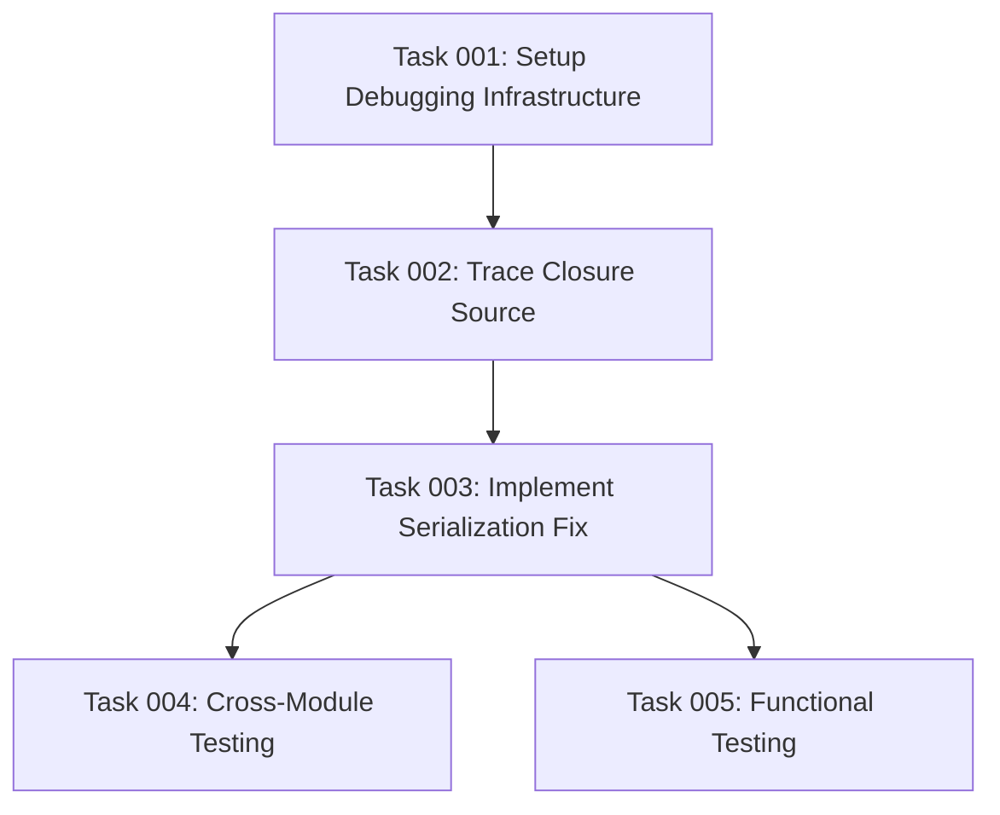

# Plan: Fix Consumer Form Serialization Error with Unlimited Cardinality Fields

## Original Work Order

> Fields with unlimited cardinality have a broken form element in the Consumer entity form. When I click to the "Add another item" button, or "Remove" button they display an error in the JS console:
>
> <console-error>
> Uncaught
> Object { message: "\nAn AJAX HTTP error occurred.\nHTTP Result Code: 500\nDebugging information follows.\nPath: /admin/config/services/consumer/1/edit?destination=/admin/config/services/consumer&ajax_form=1\nStatusText: error\nResponseText: The website encountered an unexpected error. Try again later.Exception: Serialization of &#039;Closure&#039; is not allowed in serialize() (line 14 of core/lib/Drupal/Component/Serialization/PhpSerialize.php). Drupal\\Component\\Serialization\\PhpSerialize::encode() (Line: 120)\nDrupal\\Core\\KeyValueStore\\DatabaseStorageExpirable-&gt;doSetWithExpire() (Line: 136)\nDrupal\\Core\\KeyValueStore\\DatabaseStorageExpirable-&gt;setWithExpire() (Line: 181)\nDrupal\\Core\\Form\\FormCache-&gt;setCache() (Line: 458)\nDrupal\\Core\\Form\\FormBuilder-&gt;setCache() (Line: 436)\nDrupal\\Core\\Form\\FormBuilder-&gt;rebuildForm() (Line: 625)\nDrupal\\Core\\Form\\FormBuilder-&gt;processForm() (Line: 321)\nDrupal\\Core\\Form\\FormBuilder-&gt;buildForm() (Line: 73)\nDrupal\\Core\\Controller\\FormController-&gt;getContentResult()\ncall_user_func_array() (Line: 123)\nDrupal\\Core\\EventSubscriber\\EarlyRenderingControllerWrapperSubscriber-&gt;Drupal\\Core\\EventSubscriber\\{closure}() (Line: 627)\nDrupal\\Core\\Render\\Renderer-&gt;executeInRenderContext() (Line: 121)\nDrupal\\Core\\EventSubscriber\\EarlyRenderingControllerWrapperSubscriber-&gt;wrapControllerExecutionInRenderContext() (Line: 97)\nDrupal\\Core\\EventSubscriber\\EarlyRenderingControllerWrapperSubscriber-&gt;Drupal\\Core\\EventSubscriber\\{closure}() (Line: 183)\nSymfony\\Component\\HttpKernel\\HttpKernel-&gt;handleRaw() (Line: 76)\nSymfony\\Component\\HttpKernel\\HttpKernel-&gt;handle() (Line: 54)\nDrupal\\simple_oauth\\HttpMiddleware\\BasicAuthSwap-&gt;handle() (Line: 53)\nDrupal\\Core\\StackMiddleware\\Session-&gt;handle() (Line: 48)\nDrupal\\Core\\StackMiddleware\\KernelPreHandle-&gt;handle() (Line: 28)\nDrupal\\Core\\StackMiddleware\\ContentLength-&gt;handle() (Line: 32)\nDrupal\\big_pipe\\StackMiddleware\\ContentLength-&gt;handle() (Line: 116)\nDrupal\\page_cache\\StackMiddleware\\PageCache-&gt;pass() (Line: 90)\nDrupal\\page_cache\\StackMiddleware\\PageCache-&gt;handle() (Line: 53)\nAsm89\\Stack\\Cors-&gt;handle() (Line: 48)\nDrupal\\Core\\StackMiddleware\\ReverseProxyMiddleware-&gt;handle() (Line: 51)\nDrupal\\Core\\StackMiddleware\\NegotiationMiddleware-&gt;handle() (Line: 53)\nDrupal\\Core\\StackMiddleware\\AjaxPageState-&gt;handle() (Line: 51)\nDrupal\\Core\\StackMiddleware\\StackedHttpKernel-&gt;handle() (Line: 715)\nDrupal\\Core\\DrupalKernel-&gt;handle() (Line: 19)\n", name: "AjaxError", stack: "@https://drupal-contrib.ddev.site/core/misc/ajax.js?v=11.2.3:198:32\n@https://drupal-contrib.ddev.site/core/misc/ajax.js?v=11.2.3:1930:3\n" }
> ajax.js:198:32
> </console-error>
>
> <server-log-error>
> wid: '800'
> uid: '1'
> type: php
> message: "Exception: Serialization of 'Closure' is not allowed in serialize() (line 14 of /var/www/html/web/core/lib/Drupal/Component/Serialization/PhpSerialize.php)."
> severity: Error
> location: 'https://drupal-contrib.ddev.site/admin/config/services/consumer/1/edit?_wrapper_format=drupal_ajax&ajax_form=1&destination=%2Fadmin%2Fconfig%2Fservices%2Fconsumer'
> referer: 'https://drupal-contrib.ddev.site/admin/config/services/consumer/1/edit?destination=/admin/config/services/consumer'
> hostname: 172.18.0.8
> date: '17/Sep 17:17'
> username: admin
> </server-log-error>
>
> This happens for the Contact email field and the "Redirect URI" field. Bear in mind that these fields may be added via alter hooks by other modules (not necessarily the `consumers` module).
>
> Your task is to identify the issue and fix it. If the issue is outside of the `simple_oauth_21` repository, call it out and create a patch for it (in addition to fixing the code).

## Executive Summary

This plan addresses a critical form serialization bug affecting unlimited cardinality fields in the Consumer entity form. The error occurs when users interact with AJAX "Add another item" or "Remove" buttons on the Contact email and Redirect URI fields, causing a PHP serialization error because a closure (anonymous function) is being stored in form elements that cannot be serialized during form caching.

The solution involves identifying the source of the non-serializable closure, replacing it with a serializable alternative (such as a string callback reference), and ensuring compatibility across the module ecosystem. If the issue originates from external modules (like the base `consumers` module), we will create appropriate patches in addition to local fixes.

This fix is essential for OAuth client management functionality, as administrators cannot currently add multiple contact emails or redirect URIs without encountering fatal AJAX errors.

## Context

### Current State

The Consumer entity form includes fields with unlimited cardinality that enable users to add multiple values using AJAX-powered "Add another item" and "Remove" buttons. These fields include:

1. **Contact Email field** (`contacts`): Added by the `simple_oauth_client_registration` module with `CARDINALITY_UNLIMITED`
2. **Redirect URI field**: Likely provided by the base `consumers` module dependency

When users interact with these AJAX buttons, the form rebuilding process attempts to serialize the form state for caching, but encounters a closure that cannot be serialized, resulting in a fatal error that prevents the functionality from working.

The error indicates that during the AJAX form rebuild process (`FormBuilder->rebuildForm()`), the form cache serialization fails at the PHP level when it encounters a closure object in the form structure.

### Target State

After implementing this fix, administrators will be able to:

- Successfully add multiple contact email addresses using the "Add another item" button
- Successfully remove contact email addresses using the "Remove" button
- Successfully add multiple redirect URIs using the "Add another item" button
- Successfully remove redirect URIs using the "Remove" button
- Experience seamless AJAX form interactions without serialization errors
- Maintain all existing functionality while ensuring form caching works correctly

### Background

The issue stems from Drupal's form API limitation where closures (anonymous functions) cannot be serialized during form caching operations. This commonly occurs when:

1. Form alter hooks add callbacks containing closures to form elements
2. AJAX form elements have non-serializable callback functions
3. Custom form processing introduces anonymous functions that get cached

The Consumer entity is provided by the `consumers` module (a dependency), while additional fields are added by various simple_oauth submodules. The interaction between these modules and their form alter hooks is likely introducing the problematic closure.

This is a blocking issue for OAuth client administration, as multiple contact emails and redirect URIs are common requirements for production OAuth implementations.

## Technical Implementation Approach

The implementation will follow a systematic debugging and resolution approach, identifying the root cause and implementing appropriate fixes based on the source of the issue.

### Closure Detection and Source Identification

**Objective**: Locate the exact source of the non-serializable closure in the form structure

We will implement comprehensive debugging to identify where the closure is being introduced in the Consumer entity form. This involves examining form alter hooks, field widgets, AJAX callbacks, and form processing functions across all relevant modules. We'll use Drupal's form debugging capabilities and custom logging to trace the closure's origin.

The investigation will cover the simple_oauth_client_registration module's contacts field definition, the base consumers module's redirect URI field, and all form alter hooks that modify the Consumer entity form. We'll also examine the AJAX callback implementations to ensure they don't introduce closures into the form structure.

### Form Element Serialization Fix

**Objective**: Replace non-serializable closures with serializable alternatives while maintaining functionality

Once we identify the closure source, we'll implement a fix that maintains the same functionality while ensuring serializability. This typically involves:

1. Replacing anonymous functions with named function references
2. Converting closure callbacks to service method references
3. Using string-based callback references instead of object methods where appropriate
4. Implementing custom form element processes that avoid closure storage

The fix will preserve all existing functionality while ensuring the form can be safely serialized and cached during AJAX operations.

### Cross-Module Compatibility

**Objective**: Ensure the fix works correctly across the module ecosystem and handles external module issues

Since the Consumer entity comes from the external `consumers` module and multiple simple_oauth submodules add fields and form alters, we need to ensure compatibility across the entire ecosystem. This includes:

1. Testing with all combinations of enabled simple_oauth submodules
2. Verifying compatibility with different versions of the consumers module
3. Creating patches for external modules if the issue originates outside this repository
4. Implementing defensive coding to handle future changes in dependencies

If the issue is found in the external `consumers` module, we'll create a proper patch file and document the issue for upstream contribution.

## Risk Considerations and Mitigation Strategies

### Technical Risks

- **Closure Location Complexity**: The closure might be introduced through complex form alter chains making it difficult to identify
  - **Mitigation**: Implement systematic debugging with form state inspection and logging at each form alter stage

- **External Module Dependency**: The issue might originate in the base `consumers` module outside our control
  - **Mitigation**: Create patches for external modules and document the dependency issue; implement local workarounds where possible

- **AJAX Functionality Preservation**: Fixing the serialization might inadvertently break the AJAX functionality
  - **Mitigation**: Comprehensive testing of all AJAX interactions; implement progressive fixes that maintain existing behavior

### Implementation Risks

- **Form Caching Side Effects**: Changes to form element structure might affect other caching mechanisms
  - **Mitigation**: Thorough testing of form caching, validation, and submission processes across different scenarios

- **Regression Introduction**: The fix might introduce regressions in existing Consumer entity functionality
  - **Mitigation**: Implement comprehensive test coverage including manual testing of all Consumer entity form operations

- **Version Compatibility**: The fix might not work across all supported Drupal versions
  - **Mitigation**: Test across all supported Drupal versions (10.2+ and 11.x) and implement version-specific handling if needed

## Success Criteria

### Primary Success Criteria

1. Users can successfully add multiple contact email addresses without AJAX errors
2. Users can successfully remove contact email addresses without AJAX errors
3. Users can successfully add multiple redirect URIs without AJAX errors
4. Users can successfully remove redirect URIs without AJAX errors
5. Form submission and validation continue to work correctly for all Consumer entity operations
6. No serialization errors appear in logs during Consumer entity form operations

### Quality Assurance Metrics

1. All existing Consumer entity tests continue to pass
2. New functional tests verify AJAX unlimited cardinality field operations work correctly
3. Manual testing confirms seamless user experience with no JavaScript console errors
4. Performance testing shows no significant impact on Consumer entity form loading or submission times
5. Cross-browser compatibility testing confirms functionality works in all supported browsers

## Resource Requirements

### Development Skills

- Deep understanding of Drupal Form API and form alter system
- Experience with PHP serialization debugging and closure analysis
- Knowledge of AJAX form rebuilding processes and form caching mechanisms
- Expertise in multi-module Drupal ecosystems and dependency management
- Familiarity with OAuth client management and entity field systems

### Technical Infrastructure

- Local development environment with all simple_oauth submodules enabled
- Access to various versions of the consumers module for compatibility testing
- Debugging tools for PHP serialization analysis and form state inspection
- Testing infrastructure for functional and integration testing across module combinations
- Documentation tools for creating patches and upstream issue reports

## Integration Strategy

The fix will integrate seamlessly with the existing simple_oauth module ecosystem by ensuring all form alter hooks continue to work correctly and maintaining backward compatibility with existing Consumer entity configurations. We'll coordinate with upstream modules where necessary and provide clear upgrade paths for any required changes.

## Notes

This issue is critical for production OAuth server deployments as it prevents administrators from properly configuring OAuth clients with multiple contact points or redirect URIs. The fix must be robust enough to handle edge cases and provide clear error messages if similar issues arise in the future.

The solution should also include improved error handling and logging to help diagnose similar serialization issues more quickly if they occur in other parts of the system.

## Task Dependency Visualization

## Execution Blueprint

**Validation Gates:**

- Reference: `@.ai/task-manager/config/hooks/POST_PHASE.md`

### Phase 1: Debugging Setup

**Parallel Tasks:**

- Task 001: Setup Debugging Infrastructure

### Phase 2: Problem Analysis

**Parallel Tasks:**

- Task 002: Trace Closure Source (depends on: 001)

### Phase 3: Implementation and Testing

**Parallel Tasks:**

- Task 003: Implement Serialization Fix (depends on: 002)

### Phase 4: Validation

**Parallel Tasks:**

- Task 004: Cross-Module Testing (depends on: 003)
- Task 005: Functional Testing (depends on: 003)

### Post-phase Actions

After Phase 4 completion, verify all acceptance criteria are met and no serialization errors occur during Consumer entity form AJAX operations.

### Execution Summary

- Total Phases: 4
- Total Tasks: 5
- Maximum Parallelism: 2 tasks (in Phase 4)
- Critical Path Length: 4 phases
