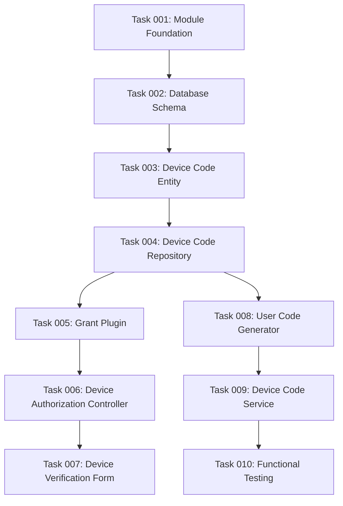

# Plan: RFC 8628 Device Flow Implementation for Simple OAuth

## Original Work Order

> Implementation Steps for RFC 8628 Device Flow
>
> IMPORTANT make sure to leverage the league/oauth2-server to its full extent for this implementation. Use the simple_oauth module as a guide on how to do it.
>
> CRITICAL you cannot update the `simple_oauth` module! If you really need to. You need to let me know.
>
> 1. Create Device Flow Sub-module (simple_oauth_device_flow)
>
> web/modules/contrib/simple_oauth_21/modules/simple_oauth_device_flow/
> ├── simple_oauth_device_flow.info.yml
> ├── simple_oauth_device_flow.module
> ├── simple_oauth_device_flow.routing.yml
> ├── simple_oauth_device_flow.services.yml
> ├── simple_oauth_device_flow.install
> ├── config/
> │ ├── schema/
> │ │ └── simple_oauth_device_flow.schema.yml
> │ └── install/
> │ └── simple_oauth_device_flow.settings.yml
> └── src/
> ├── Controller/
> │ ├── DeviceAuthorizationController.php
> │ └── DeviceVerificationController.php
> ├── Form/
> │ └── DeviceVerificationForm.php
> ├── Plugin/
> │ └── Oauth2Grant/
> │ └── DeviceCodeGrant.php
> ├── Service/
> │ ├── DeviceCodeService.php
> │ └── UserCodeGenerator.php
> ├── Entity/
> │ └── DeviceCode.php
> └── Repository/
> └── DeviceCodeRepository.php
>
> [Additional specifications provided...]

## Executive Summary

This plan implements the OAuth 2.0 Device Authorization Grant (RFC 8628) as a dedicated sub-module within the simple_oauth_21 ecosystem. The implementation leverages the existing DeviceCodeGrant class from league/oauth2-server v9.0, which provides the core grant logic. Our module will provide the necessary Drupal integration layer, including entity storage, repository implementations, and user-facing endpoints. This approach ensures RFC compliance while maintaining consistency with existing Simple OAuth patterns and avoiding any modifications to the parent simple_oauth module.

The device flow enables OAuth authorization for devices with limited input capabilities (smart TVs, CLI tools, IoT devices) by displaying a short user code that users enter on a secondary device with full browser capabilities. This implementation will provide all required endpoints and integrate seamlessly with the existing OAuth infrastructure.

## Context

### Current State

The simple_oauth module currently supports standard OAuth 2.0 flows (authorization code, client credentials, refresh token) but lacks support for the Device Authorization Grant specified in RFC 8628. Devices with limited input capabilities cannot use traditional OAuth flows effectively. The league/oauth2-server library (v9.0) already includes a DeviceCodeGrant implementation, but no Drupal integration exists to leverage this functionality.

### Target State

A fully functional RFC 8628-compliant Device Authorization Grant implementation that:

- Provides device authorization and verification endpoints
- Generates secure device codes and user-friendly verification codes
- Integrates with existing Simple OAuth token infrastructure
- Maintains all security requirements specified in the RFC
- Offers configurable parameters for code lifetime, polling intervals, and character sets

### Background

RFC 8628 was published to address OAuth authorization challenges for input-constrained devices. The league/oauth2-server library added Device Code Grant support, providing the foundation for our implementation. The simple_oauth_21 module already demonstrates successful patterns for extending Simple OAuth with new grant types through its sub-modules (PKCE, native apps, server metadata).

## Technical Implementation Approach

### Module Structure and Foundation

**Objective**: Create the simple_oauth_device_flow sub-module with proper Drupal module structure and dependencies.

The module will be structured as a sub-module within simple_oauth_21, following established patterns from other sub-modules like simple_oauth_pkce. The module will declare dependencies on simple_oauth and implement standard Drupal hooks for installation and configuration.

The module structure will include:

- Module definition files (.info.yml, .module)
- Service definitions for dependency injection
- Routing configuration for new endpoints
- Configuration schema for settings
- Database installation hooks

### Device Code Entity Implementation

**Objective**: Implement the DeviceCodeEntityInterface from league/oauth2-server as a Drupal entity.

The DeviceCode entity will extend Drupal's ContentEntityBase and implement DeviceCodeEntityInterface. This dual inheritance allows the entity to function within both Drupal's entity system and the league/oauth2-server framework. The entity will store:

- Device code (unique identifier)
- User code (human-readable code)
- Client ID (reference to consumer entity)
- Scopes (serialized array)
- Timestamps (creation, expiration, last polled)
- User association (once authorized)
- Authorization status

Database schema will be created through hook_schema() in the .install file, creating the oauth2_device_code table with appropriate indexes on device_code and user_code fields for efficient lookups.

### Repository Implementation

**Objective**: Implement DeviceCodeRepositoryInterface to bridge league/oauth2-server with Drupal's storage system.

The DeviceCodeRepository class will implement all required methods from DeviceCodeRepositoryInterface:

- getNewDeviceCode(): Creates new entity instances
- persistDeviceCode(): Saves entities to database
- getDeviceCodeEntityByDeviceCode(): Retrieves by device code
- revokeDeviceCode(): Marks codes as revoked
- isDeviceCodeRevoked(): Checks revocation status

The repository will use Drupal's entity storage system for persistence while ensuring compatibility with league/oauth2-server's expectations.

### Grant Plugin Implementation

**Objective**: Create the Device Code Grant plugin that integrates with Simple OAuth's grant system.

The DeviceCodeGrant plugin will extend Oauth2GrantBase and configure the league/oauth2-server DeviceCodeGrant. It will:

- Initialize the grant with appropriate repositories
- Set verification URI from configuration
- Configure TTL and polling intervals
- Register with Simple OAuth's grant plugin system

The plugin will use Drupal's plugin annotation system to make it discoverable by Simple OAuth's grant manager.

### Device Authorization Endpoint

**Objective**: Implement the /oauth/device_authorization endpoint for initiating device flow.

The DeviceAuthorizationController will handle POST requests to initiate the device flow. It will:

- Validate client credentials
- Generate device and user codes through the grant
- Return RFC-compliant JSON response
- Store device code entity for later verification

The controller will leverage the DeviceCodeGrant's respondToDeviceAuthorizationRequest() method, ensuring RFC compliance.

### Device Verification Interface

**Objective**: Create the user-facing verification page at /oauth/device.

The DeviceVerificationForm will provide a simple interface where users:

- Enter the user code displayed on their device
- Authenticate if not already logged in
- Approve or deny the authorization request
- See confirmation of successful authorization

The form will use Drupal's Form API with proper validation and CSRF protection. Upon successful verification, it will call the grant's completeDeviceAuthorizationRequest() method.

### Token Endpoint Integration

**Objective**: Enable the existing /oauth/token endpoint to handle device_code grant requests.

Since Simple OAuth already routes token requests through league/oauth2-server, the Device Code Grant will automatically be available once registered. The grant will handle:

- Polling requests from devices
- Rate limiting responses (slow_down)
- Authorization pending responses
- Successful token issuance

No modifications to the existing token endpoint are required; the grant plugin registration handles the integration.

### Service Layer Implementation

**Objective**: Implement supporting services for code generation and lifecycle management.

The UserCodeGenerator service will:

- Generate cryptographically secure user codes
- Use configurable character sets (excluding ambiguous characters)
- Format codes for readability (XXXX-XXXX pattern)
- Ensure uniqueness across active codes

The DeviceCodeService will:

- Manage device code lifecycle
- Clean expired codes via hook_cron
- Validate polling intervals
- Track last polling timestamps

## Risk Considerations and Mitigation Strategies

### Technical Risks

- **League/oauth2-server API Changes**: Future updates to the library might change interfaces
  - **Mitigation**: Pin the library version in composer.json and document the tested version

- **Database Performance**: Device code table could grow large with expired entries
  - **Mitigation**: Implement automated cleanup in hook_cron with configurable retention period

- **User Code Collisions**: Random generation might produce duplicate user codes
  - **Mitigation**: Implement retry logic with uniqueness validation against active codes

### Implementation Risks

- **Integration Complexity**: Bridging Drupal's entity system with league/oauth2-server interfaces
  - **Mitigation**: Follow established patterns from simple_oauth module's existing repositories

- **Rate Limiting**: Device polling could overwhelm the server without proper controls
  - **Mitigation**: Recommend rate_limits module installation and provide documentation for configuration

### Security Risks

- **Brute Force Attacks**: User codes could be guessed
  - **Mitigation**: Use sufficient entropy (8+ characters), implement time-constant comparisons, expire codes after time limit

- **Entropy Validation**: Insufficient randomness in device codes
  - **Mitigation**: Use PHP's random_bytes() for generation, ensure minimum 128 bits of entropy

## Success Criteria

### Primary Success Criteria

1. Device authorization endpoint generates valid device and user codes
2. User verification form successfully associates device with authenticated user
3. Token endpoint issues access tokens for authorized devices
4. All RFC 8628 required error responses are properly implemented
5. Integration with existing Simple OAuth infrastructure functions correctly

### Quality Assurance Metrics

1. Unit tests achieve 80% code coverage for service classes
2. Functional tests validate complete device flow end-to-end
3. No modifications made to parent simple_oauth module
4. All PHPCS and PHPStan checks pass at configured levels
5. Device codes are properly cleaned up after expiration

## Resource Requirements

### Development Skills

- PHP 8.1+ development expertise
- Drupal 10/11 module development experience
- Understanding of OAuth 2.0 and RFC 8628 specifications
- Familiarity with league/oauth2-server library architecture
- Knowledge of Drupal's Entity API and Form API

### Technical Infrastructure

- Drupal 10 or 11 installation with simple_oauth module
- league/oauth2-server v9.0 (provided by simple_oauth)
- PHP 8.1 or higher runtime
- Database with support for indexes and foreign keys
- Testing infrastructure (PHPUnit, Drupal Test framework)

## Integration Strategy

The module will integrate through established Simple OAuth extension points:

1. Grant plugins automatically discovered via plugin system
2. Repositories registered as services in the container
3. Routes added to the existing OAuth namespace
4. Configuration integrated with Simple OAuth settings
5. Entities managed through Drupal's entity system

The implementation maintains backward compatibility and requires no changes to existing OAuth flows or configurations.

## Implementation Order

1. Module foundation and database schema
2. Entity and repository implementations
3. Grant plugin creation and registration
4. Device authorization endpoint
5. User verification form
6. Service layer for code generation
7. Automated cleanup and maintenance
8. Comprehensive test coverage
9. Documentation and configuration UI

## Task Dependencies

## Execution Blueprint

**Validation Gates:**

- Reference: `.ai/task-manager/config/hooks/POST_PHASE.md`

### ✅ Phase 1: Foundation Setup

**Parallel Tasks:**

- ✔️ Task 001: Create Device Flow Module Foundation

### ✅ Phase 2: Database Layer

**Parallel Tasks:**

- ✔️ Task 002: Implement Device Code Database Schema (depends on: 001)

### ✅ Phase 3: Entity Framework

**Parallel Tasks:**

- ✔️ Task 003: Implement Device Code Entity (depends on: 002)

### ✅ Phase 4: Data Access Layer

**Parallel Tasks:**

- ✔️ Task 004: Implement Device Code Repository (depends on: 003)

### Phase 5: Core Services

**Parallel Tasks:**

- Task 005: Implement Device Code Grant Plugin (depends on: 004)
- Task 008: Implement User Code Generator Service (depends on: 004)

### Phase 6: API and Lifecycle

**Parallel Tasks:**

- Task 006: Implement Device Authorization Controller (depends on: 005)
- Task 009: Implement Device Code Lifecycle Service (depends on: 008)

### Phase 7: User Interface

**Parallel Tasks:**

- Task 007: Implement Device Verification Form and Controller (depends on: 006)

### Phase 8: Quality Assurance

**Parallel Tasks:**

- Task 010: Implement Functional Testing for Device Flow (depends on: 009)

### Execution Summary

- Total Phases: 8
- Total Tasks: 10
- Maximum Parallelism: 2 tasks (in Phase 5 and 6)
- Critical Path Length: 8 phases

## Notes

The implementation leverages league/oauth2-server's existing DeviceCodeGrant class, significantly reducing implementation complexity. The module follows established patterns from other simple_oauth_21 sub-modules for consistency. Rate limiting is delegated to external modules as specified in requirements. QR code generation for verification URIs is included as an optional enhancement configurable through settings.
