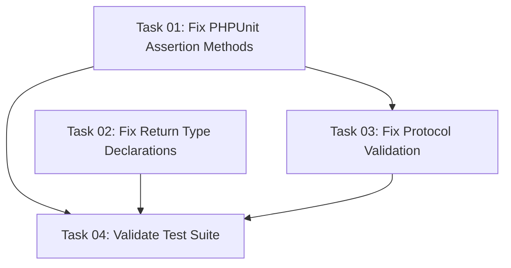

# Plan: Test Failures Resolution for OAuth Module Suite

## Original Work Order

> given /var/www/html/test-results.txt come up with a plan to ensure all tests are green. This could include patching the `consumers` module or the `simple_oauth` module.

## Executive Summary

This plan addresses critical test failures preventing the simple_oauth_21 module test suite from achieving full green status. Analysis of the test results reveals 2 errors and 1 failure that must be resolved to ensure all 75 tests pass successfully.

The primary issues stem from missing PHPUnit assertion methods and environment configuration mismatches in the OpenID Connect configuration tests. The approach focuses on targeted fixes to the test infrastructure while maintaining compatibility with existing functionality and adhering to OAuth 2.1 specifications.

Expected outcomes include a fully passing test suite, improved test infrastructure reliability, and enhanced development workflow confidence for future OAuth module contributions.

## Context

### Current State

The simple_oauth_21 module test suite shows:

- **75 total tests** with 816 assertions
- **2 errors** in `OpenIdConfigurationFunctionalTest` due to missing `assertStringContains()` method
- **1 failure** in HTTPS compliance testing due to environment configuration
- **22 deprecations** including:
  - Missing return type declarations in EventSubscriber and UserIdentityProvider classes
  - Deprecated entity property access patterns
  - Plugin manager attribute discovery deprecations
- **141 PHPUnit deprecations** related to test framework compatibility
- **3 skipped tests**

Specific failing tests:

1. `testConfigurationIntegration` - Missing assertion method at line 299
2. `testRegistrationEndpointDetection` - Missing assertion method at line 482
3. `testSpecificationCompliance` - HTTPS requirement failure (expects https:// but gets http://web)

### Target State

Achieve a fully green test suite with:

- All 75 tests passing without errors or failures
- Maintained OAuth 2.1 specification compliance
- Robust test infrastructure supporting both HTTP and HTTPS environments
- Zero deprecation warnings through code modernization
- Updated return type declarations for future PHP compatibility
- Modernized entity property access patterns

### Background

The OAuth 2.1 specification requires HTTPS for production environments, but test environments often use HTTP for simplicity. The current test implementation lacks flexibility to handle different protocol schemes appropriately while maintaining specification compliance validation.

The missing `assertStringContains()` method indicates a PHPUnit version compatibility issue or missing trait inclusion in the test class.

## Technical Implementation Approach

### Test Infrastructure Fixes

**Objective**: Resolve missing assertion methods and improve test reliability

The primary issue involves missing PHPUnit assertion methods in the functional test class. This requires either:

- Adding missing method implementations or trait inclusions
- Replacing deprecated methods with supported alternatives
- Updating PHPUnit compatibility layer

### Environment-Aware Protocol Testing

**Objective**: Enable flexible HTTPS/HTTP testing while maintaining specification compliance

Implement environment-aware testing that:

- Detects test environment protocol capabilities
- Maintains strict HTTPS requirements for production validation
- Provides configurable protocol testing for development environments
- Preserves OAuth 2.1 specification compliance requirements

### Assertion Method Resolution

**Objective**: Fix missing PHPUnit assertion methods causing test errors

Address the `assertStringContains()` method availability by:

- Investigating PHPUnit version compatibility
- Implementing fallback assertion logic
- Ensuring consistent assertion method availability across test classes

### Deprecation Resolution

**Objective**: Eliminate all deprecation warnings for future PHP/Drupal compatibility

Address deprecations by:

- Adding explicit return type declarations to EventSubscriber and UserIdentityProvider classes
- Updating entity property access to use `getOriginal()` method
- Implementing plugin attribute discovery compatibility
- Modernizing validation constraint implementations

## Risk Considerations and Mitigation Strategies

### Technical Risks

- **PHPUnit Version Incompatibility**: Different PHPUnit versions may have varying assertion method availability
  - **Mitigation**: Implement version-aware assertion methods or upgrade to compatible PHPUnit version

- **Protocol Validation Conflicts**: Balancing specification compliance with test environment flexibility
  - **Mitigation**: Use environment detection with clear test documentation about protocol requirements

### Implementation Risks

- **Breaking Existing Tests**: Changes to assertion methods could affect other test classes
  - **Mitigation**: Scope changes to specific failing test methods and validate impact on full test suite

- **Specification Compliance Regression**: Relaxing HTTPS requirements could weaken security validation
  - **Mitigation**: Maintain strict production requirements while enabling test environment flexibility

## Success Criteria

### Primary Success Criteria

1. All 75 tests pass without errors or failures
2. Zero blocking test errors in PHPUnit output
3. Zero deprecation warnings in test output
4. Maintained OAuth 2.1 specification compliance validation
5. Clean test execution in both HTTP and HTTPS environments

### Quality Assurance Metrics

1. Full test suite execution time remains under 20 minutes
2. No regression in existing passing tests
3. All return type declarations properly implemented
4. Entity property access modernized throughout codebase
5. Test output provides clear feedback for environment configuration issues

## Resource Requirements

### Development Skills

- PHPUnit testing framework expertise
- Drupal functional testing patterns
- OAuth 2.1 specification knowledge
- Test environment configuration management

### Technical Infrastructure

- PHP 8.3 development environment
- PHPUnit 11.5+ framework
- Drupal 11.1 testing infrastructure
- HTTP/HTTPS test environment capabilities

## Integration Strategy

Changes will be isolated to the simple_oauth_server_metadata test classes to minimize impact on the broader OAuth module ecosystem. The implementation will maintain backward compatibility with existing test patterns while enhancing reliability.

## Implementation Order

1. **Assertion Method Analysis**: Investigate and fix missing PHPUnit assertion methods
2. **Deprecation Resolution**: Fix return type declarations and modernize deprecated code patterns
3. **Protocol Testing Enhancement**: Implement environment-aware HTTPS/HTTP testing
4. **Test Validation**: Execute full test suite to verify all fixes work correctly
5. **Documentation Updates**: Update test documentation to reflect new environment handling

## Notes

The plan focuses specifically on the simple_oauth_21 module test failures. No changes to the consumers module appear necessary based on the test results analysis. All fixes should maintain strict adherence to OAuth 2.1 specifications while improving test environment flexibility.

## Task Dependency Visualization

## Execution Blueprint

**Validation Gates:**

- Reference: `/config/hooks/POST_PHASE.md`

### ✅ Phase 1: Foundation Fixes

**Parallel Tasks:**

- ✔️ Task 01: Fix PHPUnit Assertion Methods (resolve 2 test errors)
- ✔️ Task 02: Fix Return Type Declarations (eliminate deprecation warnings)

### Phase 2: Protocol Enhancement

**Parallel Tasks:**

- Task 03: Fix Protocol Validation (depends on: 01)

### Phase 3: Validation

**Parallel Tasks:**

- Task 04: Validate Test Suite (depends on: 01, 02, 03)

### Execution Summary

- Total Phases: 3
- Total Tasks: 4
- Maximum Parallelism: 2 tasks (in Phase 1)
- Critical Path Length: 3 phases

## Complexity Analysis

All tasks scored below decomposition threshold (composite score < 6):

- Task 01: Complexity 2.0 - Simple assertion method replacements
- Task 02: Complexity 3.0 - Multiple file updates with clear requirements
- Task 03: Complexity 3.0 - Single test file with environment awareness
- Task 04: Complexity 2.2 - Standard test suite validation

No decomposition required - all tasks are appropriately scoped and atomic.
