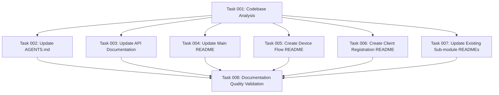

# Plan: Documentation Audit and Update

## Original Work Order

> I fear @AGENTS.md @API.md and @README.md are out of date. The same happens for README.md files in each sub-module. I want you to update them to represent the current state of the code base. Do not take the documentation at face value, corroborate it by analyzing the code. Use the best practices for each of the docimentation files we have.

## Executive Summary

This plan addresses comprehensive documentation updates for the Simple OAuth 2.1 module ecosystem by performing a thorough audit of existing documentation against actual codebase functionality. The approach prioritizes code analysis over existing documentation to ensure accuracy, identifies missing documentation for undocumented sub-modules, and applies documentation best practices consistently across all files.

The plan covers updating three main documentation files (AGENTS.md, API.md, README.md) and creating/updating README files for five sub-modules, with two currently lacking documentation entirely. This systematic approach ensures all OAuth 2.1 functionality is properly documented and accessible to users and developers.

## Context

### Current State

- **Main Documentation**: Three primary files (AGENTS.md, API.md, README.md) exist but accuracy is questioned
- **Sub-module Documentation**: Mixed state with 3 sub-modules having README files and 2 completely lacking documentation
- **Missing Documentation**: simple_oauth_device_flow and simple_oauth_client_registration have no README files despite implementing substantial functionality
- **Code vs Documentation Gap**: Existing documentation may not reflect actual implemented features and capabilities

### Target State

- All documentation files accurately reflect current codebase functionality
- Missing README files created for undocumented sub-modules
- Consistent documentation structure and quality across all modules
- API documentation precisely matches implemented endpoints and features
- AGENTS.md contains current, relevant project-specific instructions

### Background

The Simple OAuth 2.1 ecosystem consists of an umbrella module with five specialized sub-modules implementing various OAuth RFCs. Code analysis reveals sophisticated functionality including device flow (RFC 8628), dynamic client registration (RFC 7591), PKCE (RFC 7636), native app security (RFC 8252), and server metadata (RFC 8414). Current documentation inconsistencies could mislead users and developers about available functionality.

## Technical Implementation Approach

### Documentation Analysis and Code Correlation

**Objective**: Establish accurate understanding of implemented functionality versus documented capabilities

Systematic examination of each module's source code including controllers, services, forms, routing, and configuration files. Cross-reference findings with existing documentation to identify discrepancies, missing features, and outdated information. Create comprehensive functionality matrix mapping implemented features to documentation coverage.

### Main Documentation File Updates

**Objective**: Ensure primary documentation files accurately represent current project state and capabilities

Update AGENTS.md to reflect current project structure and development practices. Revise API.md to match implemented endpoints, request/response formats, and authentication mechanisms discovered through code analysis. Refresh README.md to accurately describe module ecosystem, installation procedures, and feature capabilities based on actual codebase state.

### Sub-module Documentation Creation and Updates

**Objective**: Provide complete documentation coverage for all sub-modules with consistent quality and structure

Create comprehensive README files for simple_oauth_device_flow and simple_oauth_client_registration modules. Update existing README files for simple_oauth_pkce, simple_oauth_native_apps, and simple_oauth_server_metadata to ensure accuracy. Apply consistent documentation structure, including feature descriptions, configuration instructions, API endpoints, and usage examples.

### Documentation Quality Standardization

**Objective**: Implement best practices for technical documentation consistency and usability

Establish consistent formatting, structure, and content organization across all documentation files. Include practical examples, clear installation/configuration steps, troubleshooting sections, and appropriate cross-references between related modules. Ensure documentation serves both end-users and developers effectively.

**Research Integration**: Implementation will reference and incorporate findings from `@.ai/task-manager/plans/08--documentation-audit-and-update/anthropic-2025-best-practices-research.md` to ensure adherence to the latest documentation best practices and industry standards for technical writing.

## Risk Considerations and Mitigation Strategies

### Technical Risks

- **Complex Codebase Analysis**: Understanding intricate OAuth implementations across multiple modules
  - **Mitigation**: Systematic code examination with focus on public APIs, routing, and service interfaces

- **Feature Interconnectedness**: OAuth modules have complex interdependencies that may be difficult to document clearly
  - **Mitigation**: Create dependency maps and interaction diagrams to understand module relationships

### Implementation Risks

- **Documentation Scope Creep**: Tendency to over-document or include non-essential technical details
  - **Mitigation**: Focus on user-facing functionality and maintain clear audience definition for each document type

- **Accuracy Verification**: Ensuring documented functionality matches actual code behavior
  - **Mitigation**: Test documented examples and procedures against actual module installations

### Quality Risks

- **Inconsistent Documentation Standards**: Different documentation styles across modules
  - **Mitigation**: Establish clear documentation templates and review standards before implementation

## Success Criteria

### Primary Success Criteria

1. All main documentation files (AGENTS.md, API.md, README.md) accurately reflect current codebase functionality
2. Complete README files exist for all five sub-modules with consistent structure and quality
3. API documentation precisely matches implemented endpoints with correct request/response examples
4. Zero functional discrepancies between documented features and actual code implementation

### Quality Assurance Metrics

1. Documentation completeness score of 100% for all modules (all public features documented)
2. Consistency score of 95%+ across documentation structure and formatting
3. Accuracy verification through practical testing of documented procedures and examples
4. User accessibility score ensuring documentation serves both technical and non-technical audiences

## Resource Requirements

### Development Skills

- OAuth 2.0/2.1 protocol knowledge for accurate technical documentation
- Drupal module architecture understanding for system-level documentation
- Technical writing skills for clear, accessible documentation creation
- PHP code analysis for comprehensive feature discovery

### Technical Infrastructure

- Access to complete Simple OAuth 2.1 codebase for thorough analysis
- Text editing tools supporting Markdown formatting and validation
- Documentation testing environment for verifying examples and procedures
- Reference materials including `@.ai/task-manager/plans/08--documentation-audit-and-update/anthropic-2025-best-practices-research.md` for current documentation standards

## Implementation Order

1. Code analysis and functionality mapping across all modules
2. Main documentation file updates (AGENTS.md, API.md, README.md)
3. Missing sub-module README creation (device_flow, client_registration)
4. Existing sub-module README updates and standardization
5. Cross-reference validation and final quality assurance review

## Dependency Visualization

## Execution Blueprint

**Validation Gates:**

- Reference: `@.ai/task-manager/config/hooks/POST_PHASE.md`

### Phase 1: Foundation Analysis

**Parallel Tasks:**

- Task 001: Codebase Analysis and Functionality Mapping

### Phase 2: Core Documentation Updates

**Parallel Tasks:**

- Task 002: Update AGENTS.md (depends on: 001)
- Task 003: Update API Documentation (depends on: 001)
- Task 004: Update Main README (depends on: 001)

### Phase 3: Sub-module Documentation

**Parallel Tasks:**

- Task 005: Create Device Flow README (depends on: 001)
- Task 006: Create Client Registration README (depends on: 001)
- Task 007: Update Existing Sub-module READMEs (depends on: 001)

### Phase 4: Quality Assurance

**Parallel Tasks:**

- Task 008: Documentation Quality Validation (depends on: 002, 003, 004, 005, 006, 007)

### Execution Summary

- Total Phases: 4
- Total Tasks: 8
- Maximum Parallelism: 3 tasks (in Phase 2 and Phase 3)
- Critical Path Length: 4 phases
