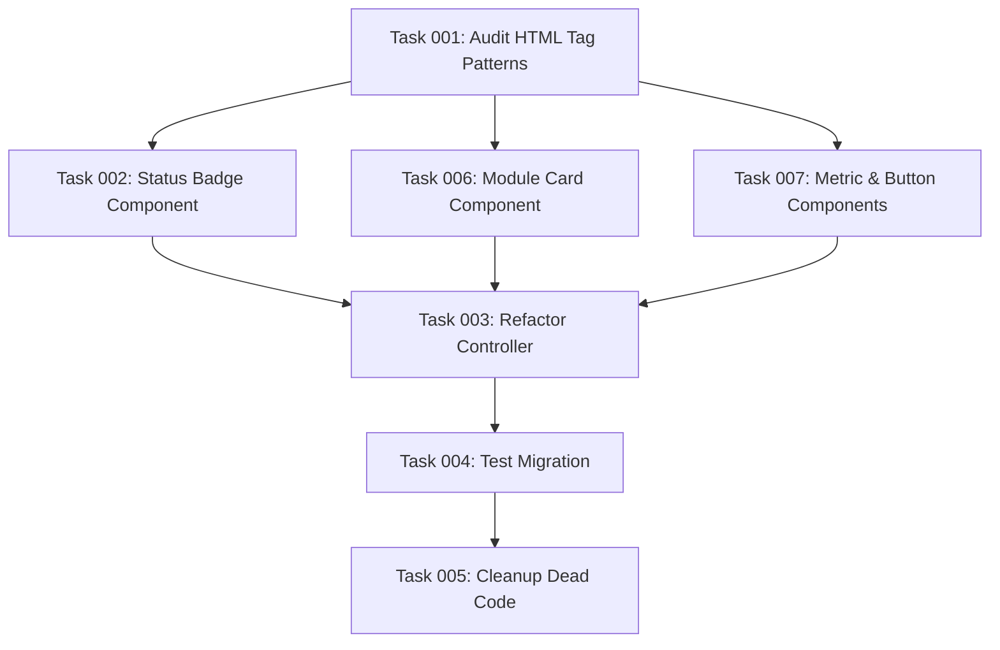

# Plan: OAuth 2.1 Compliance Module SDC Migration

## Original Work Order

> I see lots of places where the admin UI is using `#markup` with HTML strings in the PHP files. This is OK for short unstyled strings, but bad otherwise. I want you to rework the module to leverage Single-Directory Components. This will promote re-usability of UI components, DRYness, and better separation of concerns. Use tools to extract documentation from https://www.drupal.org/docs/develop/theming-drupal/using-single-directory-components and sub-pages (including https://www.drupal.org/docs/develop/theming-drupal/using-single-directory-components/frequently-asked-questions)

## Executive Summary

This plan migrates the OAuth 2.1 compliance module from repetitive `html_tag` render arrays to reusable Single-Directory Components (SDCs). The current implementation contains extensive duplication of UI patterns including status indicators, badges, module cards, and administrative forms. By extracting these into atomic, reusable SDCs, we will achieve better separation of concerns, improved maintainability, and enhanced component reusability across the module.

The migration will focus on identifying common UI patterns, creating flexible SDC templates with props and slots for data injection, and refactoring the controller logic to use these components instead of inline HTML generation. This approach aligns with modern Drupal theming practices and significantly reduces code duplication while making the UI more consistent and maintainable.

## Context

### Current State

The OAuth 2.1 compliance module currently generates UI through extensive use of `html_tag` render elements directly in PHP controller code. Analysis reveals:

- **120+ instances** of `html_tag` render arrays across the controller
- **Repeated patterns** for status indicators, badges, titles, descriptions, and module cards
- **Inline HTML generation** mixed with business logic in controller methods
- **Poor separation of concerns** between data processing and presentation
- **Difficult maintenance** when UI changes require modifications across multiple methods

Common repetitive patterns include:

- Status indicators with icons and labels
- Priority/complexity badges with dynamic classes
- Module cards with titles, descriptions, and actions
- Metric containers with labels and values
- Action buttons and links

### Target State

After migration, the module will use a library of reusable SDCs that provide:

- **Atomic components** for common UI elements (badges, cards, indicators)
- **Flexible props system** for data injection and configuration
- **Slots for complex content** allowing nested components and custom markup
- **Clean separation** between controller logic and presentation
- **Consistent styling** through centralized component templates
- **Easy maintenance** with changes isolated to component files

### Background

Single-Directory Components (SDCs) became part of Drupal Core's render system in version 10.3 and provide a modern approach to component-based theming. They combine HTML templates, CSS, and JavaScript into reusable, configurable elements that integrate seamlessly with Drupal's render array system.

The OAuth compliance module is an ideal candidate for SDC migration due to its repetitive UI patterns and administrative interface focus, which can greatly benefit from component reusability and maintainability improvements.

## Technical Implementation Approach

### Component Identification and Design

Analyze existing `html_tag` usage patterns to identify atomic components that can be extracted and made reusable. Focus on components that appear multiple times with slight variations, which can be handled through props and slots.

**Objective**: Create a foundational library of reusable UI components that eliminate duplication and improve maintainability.

The approach involves conducting a comprehensive audit of the controller's render arrays to catalog recurring patterns, grouping similar elements into component families, and designing flexible interfaces using props for configuration and slots for content injection. Priority will be given to components that appear most frequently and offer the highest potential for reuse across the module.

### Core Component Library Development

Build the essential SDC library with components for status management, content display, and user interactions that form the backbone of the OAuth compliance interface.

**Objective**: Establish reusable components for status indicators, badges, cards, and other common UI patterns used throughout the module.

This includes creating Status Badge components for displaying module states with appropriate icons and styling, Module Card components for consistent presentation of OAuth capability information, Metric Display components for statistical information presentation, and Action Button components for consistent user interaction elements. Each component will be designed with flexible props to handle variations in content, styling, and behavior while maintaining visual consistency.

### Controller Refactoring and Integration

Systematically replace `html_tag` render arrays with SDC component calls throughout the controller, simplifying the controller logic and improving code organization.

**Objective**: Transform the controller from a UI generation engine to a clean data processing layer that leverages reusable components for presentation.

The refactoring process involves replacing complex render array structures with simple component invocations, moving presentation logic from PHP into Twig templates, implementing props-based data passing for component configuration, and utilizing slots for flexible content areas that require dynamic or nested content. This separation will make the controller more focused on business logic while delegating all presentation concerns to the component layer.

### Template System and Asset Management

Establish proper Twig templates, CSS styling, and JavaScript functionality for each component, ensuring consistent design and behavior across the module.

**Objective**: Create a cohesive design system with proper styling and functionality that can be easily maintained and extended.

This involves developing Twig templates that utilize Drupal's theming best practices, implementing CSS using BEM methodology for maintainable styling, adding JavaScript for interactive components where needed, and ensuring proper asset libraries are defined for optimal performance. The system will support theming overrides and customization while maintaining a consistent base design.

### Testing and Quality Assurance

Validate that the migrated components function correctly, maintain existing functionality, and provide the expected improvements in maintainability and reusability.

**Objective**: Ensure the migration preserves all existing functionality while delivering the promised benefits of improved code organization and component reusability.

This includes comprehensive testing of all dashboard functionality to ensure no regressions, validation of component reusability across different contexts, verification of proper theming and asset loading, and performance testing to ensure the component system doesn't negatively impact load times. Documentation will be created to guide future component usage and extension.

## Risk Considerations and Mitigation Strategies

### Technical Risks

- **Component Design Complexity**: Over-engineering components with too many props or overly complex slot structures
  - **Mitigation**: Start with simple, focused components and iterate based on actual usage patterns. Follow the principle of "make it work, then make it reusable"

- **Performance Impact**: Additional template processing and asset loading could affect page performance
  - **Mitigation**: Use Drupal's built-in caching mechanisms, optimize asset libraries, and benchmark performance before and after migration

- **SDC Learning Curve**: Team unfamiliarity with Single-Directory Components could slow development
  - **Mitigation**: Begin with simple components to build confidence, reference Drupal documentation extensively, and create internal documentation for common patterns

### Implementation Risks

- **Scope Creep**: Temptation to redesign UI while migrating components
  - **Mitigation**: Focus purely on extracting existing patterns into components without changing functionality or visual design

- **Incomplete Migration**: Leaving some `html_tag` usage in place could reduce consistency benefits
  - **Mitigation**: Create comprehensive audit checklist and systematically verify each pattern has been migrated

- **Component Fragmentation**: Creating too many small components that don't provide reusability benefits
  - **Mitigation**: Apply the "rule of three" - only create components that are used in at least three places or have clear reusability potential

## Success Criteria

### Primary Success Criteria

1. **Elimination of html_tag patterns**: All repetitive `html_tag` render arrays replaced with SDC components (target: 95%+ reduction)
2. **Component reusability**: Each created component used in at least 3 different contexts within the module
3. **Code maintainability**: UI changes require modifications in component files only, not controller methods

### Quality Assurance Metrics

1. **Functional preservation**: All existing dashboard functionality works identically after migration
2. **Visual consistency**: No visual regressions or unexpected styling changes
3. **Performance maintenance**: Page load times remain within 5% of pre-migration performance

## Resource Requirements

### Development Skills

- Drupal 10+ theming experience with Single-Directory Components
- Twig templating and Drupal render system knowledge
- CSS/SCSS for component styling
- Understanding of Drupal module development and admin interface patterns

### Technical Infrastructure

- Drupal 10.3+ environment with SDC support enabled
- Access to OAuth 2.1 compliance module codebase
- Development tools for CSS compilation and asset management
- Testing environment for validation and performance measurement

## Integration Strategy

The migration will integrate seamlessly with existing Drupal theming systems, allowing theme developers to override components as needed. Components will be designed to work within the existing admin theme while providing flexibility for custom styling in contributed or custom themes.

## Implementation Order

1. **Component Library Foundation**: Create directory structure and basic component framework
2. **Status and Badge Components**: Migrate most frequently used UI elements first
3. **Card and Container Components**: Handle complex layout components
4. **Controller Refactoring**: Systematically replace render arrays with component calls
5. **Testing and Optimization**: Validate functionality and optimize performance

## Notes

This migration represents a significant improvement in code organization and maintainability for the OAuth 2.1 compliance module. The component-based approach will serve as a model for other administrative modules and contribute to a more consistent Drupal admin experience.

Focus should remain on extracting existing patterns rather than introducing new functionality or design changes. The goal is to improve the codebase structure while preserving all current capabilities and visual appearance.

## Task Dependency Visualization

## Execution Blueprint

**Validation Gates:**

- Reference: `@.ai/task-manager/config/hooks/POST_PHASE.md`

### Phase 1: Analysis and Planning

**Parallel Tasks:**

- Task 001: Audit HTML Tag Patterns for SDC Migration

### Phase 2: Component Development

**Parallel Tasks:**

- Task 002: Create Status Badge SDC Component (depends on: 001)
- Task 006: Create Module Card SDC Component (depends on: 001)
- Task 007: Create Metric Display and Action Button SDC Components (depends on: 001)

### Phase 3: Integration

**Parallel Tasks:**

- Task 003: Refactor Controller to Use SDC Components (depends on: 002, 006, 007)

### Phase 4: Validation

**Parallel Tasks:**

- Task 004: Test SDC Migration and Validate Functionality (depends on: 003)

### Phase 5: Optimization

**Parallel Tasks:**

- Task 005: Clean Up Dead Code and Styles After SDC Migration (depends on: 004)

### Post-phase Actions

- Performance benchmarking and comparison
- Documentation updates for component usage
- Code review and quality assurance validation

### Execution Summary

- Total Phases: 5
- Total Tasks: 6
- Maximum Parallelism: 3 tasks (in Phase 2)
- Critical Path Length: 5 phases
