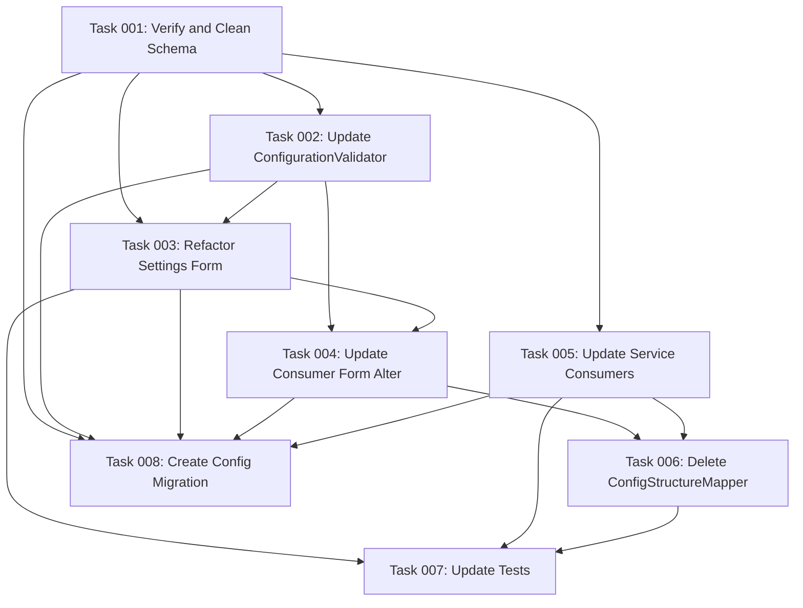

# Plan: Configuration Structure Standardization

## Original Work Order

> The ConfigStructureMapper should be unnecessary. This is a simple tasks. We should come up with a SINGLE structure for all the things. This includes the validation, the configuration, and the form structure. Remember that changes in the form structure may have ripple effects in the form callbacks.
>
> I want to standardize on a NESTED structure. Thus, `webview_detection` becomes `[webview][detection]`; `allow_custom_uri_schemes` becomes `[allow][custom_uri_schemes]`; `enhanced_pkce_for_native` becomes `['native']['enhanced_pkce']`; `logging_level` becomes `[logging][level]`; ...

## Executive Summary

This plan addresses structural inconsistencies in the Simple OAuth Native Apps module's configuration system. Currently, the module maintains two parallel configuration structures—a flat structure for forms and a nested structure for validators—requiring a ConfigStructureMapper service to bridge between them. This creates unnecessary complexity, maintenance burden, and potential for configuration mismatches.

The solution standardizes on a single **nested configuration structure** throughout the entire codebase: configuration schema, form definitions, validation logic, and all service consumers. By adopting nested arrays consistently (e.g., `[webview][detection]`, `[allow][custom_uri_schemes]`, `[native][enhanced_pkce]`), we eliminate the mapping layer entirely, simplify the codebase, and reduce the risk of structural mismatches.

Key benefits include: simpler code maintenance, elimination of the ConfigStructureMapper service, consistent structure across all layers, reduced cognitive overhead for developers, and a more reliable configuration system with fewer potential points of failure.

## Context

### Current State

The `simple_oauth_native_apps` module currently maintains **two different configuration structures**:

1. **Flat Structure** (used in forms and main configuration):
   - `webview_detection`
   - `allow_custom_uri_schemes`
   - `allow_loopback_redirects`
   - `enhanced_pkce_for_native`
   - `logging_level`
   - `webview_whitelist`
   - `webview_patterns`

2. **Nested Structure** (used by validators):
   - `webview.detection`
   - `allow.custom_uri_schemes`
   - `allow.loopback_redirects`
   - `native.enhanced_pkce`
   - `native.enforce`
   - `log.level`
   - `webview.whitelist`
   - `webview.patterns`

The ConfigStructureMapper service (src/Service/ConfigStructureMapper.php) bridges these structures with `mapFormToValidatorStructure()` and `mapValidatorToFormStructure()` methods. This creates:

- **Maintenance overhead**: Every configuration change requires updating multiple structure representations
- **Complexity**: Developers must understand two structures and their mappings
- **Error risk**: Structural mismatches can cause validation failures
- **Code duplication**: Mapping logic duplicates field definitions

**Files affected by current dual structure:**

- `src/Service/ConfigStructureMapper.php` (170 lines)
- `src/Form/NativeAppsSettingsForm.php` (uses config paths like `webview.detection` to read, but uses flat structure in form arrays)
- `src/Form/ConsumerNativeAppsFormAlter.php` (uses ConfigStructureMapper in validation)
- `src/Service/ConfigurationValidator.php` (expects nested structure for validation)
- `config/schema/simple_oauth_native_apps.schema.yml` (already partially nested)
- All service consumers that read configuration
- Tests that validate structure mapping

### Target State

**Single nested structure throughout entire codebase:**

```yaml
webview:
  detection: 'off|warn|block'
  custom_message: 'string'
  whitelist: ['array', 'of', 'patterns']
  patterns: ['array', 'of', 'patterns']

allow:
  custom_uri_schemes: 'auto-detect|native|web'
  loopback_redirects: 'auto-detect|native|web'

native:
  enhanced_pkce: 'auto-detect|enhanced|not-enhanced'
  enforce: 'off|S256|plain'

log:
  pkce_validations: boolean
  detection_decisions: boolean

require_exact_redirect_match: boolean
enforce_native_security: boolean
```

**Expected outcomes:**

- ConfigStructureMapper service deleted entirely
- Forms use nested array structure directly with `#tree => TRUE`
- Configuration schema remains nested (mostly done)
- All services read/write nested configuration consistently
- Tests simplified to validate single structure
- Form callbacks updated to handle nested structure
- Zero mapping logic needed

### Background

The configuration schema (simple_oauth_native_apps.schema.yml) is already mostly standardized on nested structure. The primary issue is that forms were originally built with flat structures, and ConfigStructureMapper was introduced as a compatibility layer to bridge between form values and validator expectations.

The module follows Drupal's configuration schema conventions where nested structures are standard practice. The flat structure was likely an initial simplification that became technical debt as the module matured.

**Key constraint:** Form structure changes will have ripple effects on:

- Form validation callbacks (validateFormSpecificRules, convertFormValuesToConfig)
- Form submission handlers (submitForm in NativeAppsSettingsForm)
- Consumer form alter validation/submission (validateConsumerNativeAppsSettings, submitConsumerNativeAppsSettings)
- AJAX callbacks that read form values
- Any code that uses `$form_state->getValue()` to read nested values

## Technical Implementation Approach

### Component 1: Configuration Schema Verification

**Objective**: Ensure the configuration schema already uses the target nested structure consistently

The configuration schema (config/schema/simple_oauth_native_apps.schema.yml) should already be mostly correct, as it defines nested mappings for `webview`, `allow`, `native`, and `log`. This component verifies the schema matches the target structure exactly and removes any legacy flat field definitions.

**Tasks:**

- Review current schema structure (lines 1-147)
- Verify all nested mappings are correct
- Remove or deprecate legacy fields (lines 86-97): `enhanced_pkce_for_native`, `allow_custom_uri_schemes`, `allow_loopback_redirects`
- Ensure consumer configuration schema matches global schema patterns
- Document the canonical structure

**Rationale**: The schema is the source of truth for Drupal's configuration system. Standardizing here first ensures all subsequent changes align with Drupal's typed configuration API.

### Component 2: Update NativeAppsSettingsForm Structure

**Objective**: Convert the main settings form from flat to nested structure using form arrays

The NativeAppsSettingsForm must be restructured to use nested form arrays that match the configuration schema. This requires:

1. **Form structure changes** (buildForm method, lines 93-287):
   - Set `$form['#tree'] = TRUE` (already present)
   - Restructure form elements to use nested keys matching schema
   - Example: `$form['webview']['detection']` instead of `$form['webview']['webview_detection']`
   - Update `#default_value` to read from nested config paths
   - Adjust `#states` selectors to match new nested element names

2. **Form value conversion** (convertFormValuesToConfig, lines 322-345):
   - Simplify or eliminate this method since form structure matches config structure
   - Direct mapping: form values → configuration values
   - No transformation needed

3. **Form validation** (validateForm, validateFormSpecificRules, lines 293-393):
   - Update field references in validation logic
   - Change `$values['webview']['webview_detection']` to `$values['webview']['detection']`
   - Remove ConfigStructureMapper usage
   - Pass form values directly to ConfigurationValidator

4. **Form submission** (submitForm, lines 398-432):
   - Simplify save logic since form structure matches config structure
   - Direct save: `$config->set('webview.detection', $values['webview']['detection'])`
   - Remove intermediate mapping

**Key change pattern:**

```php
// BEFORE (flat in form, nested in config)
$form['webview']['webview_detection'] = [...];
$config->set('webview.detection', $values['webview']['webview_detection']);

// AFTER (nested everywhere)
$form['webview']['detection'] = [...];
$config->set('webview.detection', $values['webview']['detection']);
```

**Rationale**: Drupal's Form API supports nested structures natively through `#tree`. Using nested form elements that directly match configuration paths eliminates all mapping logic and makes the code self-documenting.

### Component 3: Update ConsumerNativeAppsFormAlter

**Objective**: Update consumer-specific form alterations to use nested structure and remove ConfigStructureMapper dependency

The ConsumerNativeAppsFormAlter class injects ConfigStructureMapper to convert between structures during validation (lines 50-82, 256-287). With nested structure throughout:

1. **Remove ConfigStructureMapper dependency**:
   - Remove from constructor parameters (line 55)
   - Remove property declaration (line 54)
   - Remove from service definition in simple_oauth_native_apps.services.yml

2. **Update validation logic** (validateConsumerNativeAppsSettings, lines 256-287):
   - Remove `mapFormToValidatorStructure()` call (line 281)
   - Build validation config in nested structure directly
   - Pass to ConfigurationValidator without transformation

3. **Update form element references**:
   - Ensure override fields use nested structure if they reference parent fields
   - Update any `#default_value` reads from consumer configuration
   - Verify AJAX callbacks handle nested form structure

**Rationale**: ConsumerNativeAppsFormAlter is a major consumer of ConfigStructureMapper. Removing this dependency demonstrates the end-to-end simplification achieved by standardization.

### Component 4: Update ConfigurationValidator

**Objective**: Verify validator methods already expect nested structure and document this as canonical

The ConfigurationValidator service (src/Service/ConfigurationValidator.php) already expects nested structure in most methods. This component ensures complete consistency:

1. **Review validation methods** (lines 62-247):
   - `validateWebViewConfig`: Expects `$config['webview_detection']` (line 75) - **UPDATE to `$config['webview']['detection']`**
   - `validateRedirectUriConfig`: Already uses `$config['allow_custom_uri_schemes']` (line 116) - **UPDATE to `$config['allow']['custom_uri_schemes']`**
   - `validatePkceConfig`: Already uses `$config['native']['enforce']` (line 143) - correct
   - `validateLoggingConfig`: Uses `$config['logging_level']` (line 240) - **UPDATE to `$config['log']['level']`** (note: schema uses `log`, not `logging`)

2. **Remove inconsistencies**:
   - Lines 75-80: Change from `$config['webview_detection']` to `$config['webview']['detection']`
   - Lines 83-96: Already correct with `$config['webview']['whitelist']` and `$config['webview']['patterns']`
   - Line 240: Change from `$config['logging_level']` to `$config['log']['level']`

3. **Add documentation**:
   - Document expected structure in class DocBlock
   - Remove any references to "flat structure" or mapping

**Rationale**: The validator is already 80% nested. Completing the transition ensures validation logic matches the new canonical structure and eliminates the last vestiges of flat structure expectations.

### Component 5: Update All Configuration Consumers

**Objective**: Update all services and classes that read configuration to use nested structure consistently

Multiple services read configuration from `simple_oauth_native_apps.settings`. All must transition to nested paths:

**Files to update (identified from grep results):**

1. `src/Service/NativeClientDetector.php`
2. `src/Service/MetadataProvider.php`
3. `src/Plugin/Validation/Constraint/NativeAppRedirectUriValidator.php`
4. `src/Service/RedirectUriValidator.php`
5. Any other services that call `$config->get('flat_key')`

**Change pattern for each file:**

```php
// BEFORE
$detection = $config->get('webview_detection');
$allow_custom = $config->get('allow_custom_uri_schemes');
$enhanced_pkce = $config->get('enhanced_pkce_for_native');

// AFTER
$detection = $config->get('webview.detection');
$allow_custom = $config->get('allow.custom_uri_schemes');
$enhanced_pkce = $config->get('native.enhanced_pkce');
```

**Search strategy:**

- Grep for old flat keys in all PHP files
- Replace with nested equivalents
- Update tests that mock configuration

**Rationale**: Configuration consumers represent the primary reason for the dual structure. Updating them completes the end-to-end transition and proves the structure works throughout the stack.

### Component 6: Delete ConfigStructureMapper

**Objective**: Remove the ConfigStructureMapper service and all references to it

Once all consumers use nested structure:

1. **Delete files:**
   - `src/Service/ConfigStructureMapper.php`
   - `tests/src/Unit/ConfigStructureMappingTest.php`

2. **Update service definitions:**
   - Remove from `simple_oauth_native_apps.services.yml`

3. **Verify no remaining references:**
   - Grep for `ConfigStructureMapper` across codebase
   - Remove any imports or type hints
   - Remove from any dependency injection

**Rationale**: Deleting the mapper is the final validation that standardization is complete. If deletion causes any errors, it identifies missed conversion points.

### Component 7: Update Tests

**Objective**: Update all tests to use nested configuration structure and validate new patterns

**Test files to update (from grep results):**

1. `tests/src/Unit/ConfigStructureMappingTest.php` - **DELETE (tests deleted service)**
2. `tests/src/Kernel/ServiceIntegrationTest.php` - Update config mocks
3. Any functional tests that set configuration values
4. Any unit tests for validators, forms, or services

**Update patterns:**

- Replace flat config mocks with nested equivalents
- Update assertions to check nested paths
- Add tests validating form structure matches config structure
- Test that form submission saves nested configuration correctly

**Rationale**: Tests are the safety net. Updating tests first (or alongside implementation) ensures the refactor doesn't break existing functionality.

## Risk Considerations and Mitigation Strategies

### Technical Risks

- **Form API Nested Array Handling**: Drupal's Form API may have unexpected behavior with deeply nested arrays
  - **Mitigation**: The schema already uses nesting; Drupal forms support `#tree => TRUE` natively. Test thoroughly in development environment before committing.

- **Configuration Migration**: Existing sites with flat configuration need migration path
  - **Mitigation**: Add update hook that migrates flat keys to nested structure. Use `hook_update_N()` to transform existing configuration. Provide fallback reads for legacy keys during transition period.

- **AJAX Callbacks and Form State**: AJAX callbacks may expect specific form structures
  - **Mitigation**: Review AJAX callbacks in ConsumerNativeAppsFormAlter (detectClientTypeAjax, lines 417-436) and test with nested structure. Form state values will change structure; ensure callbacks use updated paths.

### Implementation Risks

- **Incomplete Conversion**: Missing a configuration consumer causes runtime errors
  - **Mitigation**: Comprehensive grep for all flat key patterns. Run full test suite after each component. Use PHPStan/static analysis to catch undefined index errors.

- **Form Callback Ripple Effects**: Changes to form structure break validation/submission
  - **Mitigation**: Update form callbacks incrementally. Test each form operation (build, validate, submit) after structure changes. Use manual browser testing for AJAX operations.

- **Backward Compatibility**: Breaking changes for existing consumers
  - **Mitigation**: This is an internal module structure change, not a public API. If external code depends on structure, provide deprecation notices and migration guide. Consider supporting both structures temporarily with deprecation warnings.

### Testing Risks

- **Test Coverage Gaps**: Incomplete tests miss regression issues
  - **Mitigation**: Run full test suite before and after changes. Add test coverage for form structure validation. Use kernel tests to validate end-to-end configuration flow.

## Success Criteria

### Primary Success Criteria

1. **ConfigStructureMapper service deleted** - Service file and test removed, no references remain in codebase
2. **Single nested structure used everywhere** - All forms, validators, services, and configuration use `[webview][detection]` style nesting
3. **All tests pass** - Full test suite (unit, kernel, functional) passes without errors
4. **Manual form testing successful** - Settings form and consumer form can be saved and validated without errors
5. **Configuration saving works correctly** - Nested configuration saves to database and loads correctly on next form load

### Quality Assurance Metrics

1. **Zero grep results for old flat keys** - Searching for `webview_detection`, `allow_custom_uri_schemes`, `enhanced_pkce_for_native` returns no results in PHP files
2. **PHPStan clean** - Static analysis passes at project's level (level 1 per CLAUDE.md)
3. **Drupal coding standards compliance** - PHPCS passes for all modified files
4. **Test coverage maintained** - No decrease in test coverage percentage after refactor

## Resource Requirements

### Development Skills

- **Drupal Form API expertise**: Understanding of `#tree`, nested form elements, `#states`, and form value handling
- **Drupal Configuration API**: Knowledge of typed configuration, schema definitions, and configuration storage
- **PHP refactoring skills**: Ability to safely refactor across multiple files while maintaining functionality
- **Test-driven development**: Writing and updating tests alongside implementation changes

### Technical Infrastructure

- **PHPUnit**: Required for running unit, kernel, and functional tests (already configured in project)
- **PHPStan**: Static analysis tool for catching type errors (configured at level 1)
- **PHPCS**: Drupal coding standards validation (already available)
- **Development Drupal environment**: Container-based development environment as described in project CLAUDE.md

## Implementation Order

1. **Schema verification first** - Ensures source of truth is correct before changing consuming code
2. **ConfigurationValidator second** - Establishes validation layer for new structure before forms change
3. **Forms and form callbacks third** - Main touchpoint for users; validates structure works end-to-end
4. **Configuration consumers fourth** - Services can be updated incrementally after forms work
5. **Delete ConfigStructureMapper fifth** - Final validation that transition is complete
6. **Tests last** - Updated continuously but final cleanup happens after implementation complete

## Notes

**Breaking Change Consideration**: This is technically a breaking change if external code depends on configuration structure. However:

- This is a contrib module, not core
- Configuration structure is typically considered internal implementation
- The module is part of the OAuth 2.1 compliance ecosystem, likely consumed primarily by this project
- Migration path can be provided via update hook

**Form Field Name Alignment**: When updating forms, ensure field names in `$form` arrays match the configuration keys exactly. This makes the code self-documenting and eliminates the need for any field name mapping.

**Legacy Field Cleanup**: The schema includes legacy fields (lines 86-97) for backward compatibility. Consider deprecation strategy:

- Option 1: Remove legacy fields entirely in this refactor (clean break)
- Option 2: Keep legacy fields in schema but mark as deprecated with update hook to migrate
- Recommended: Option 1 (clean break) since this is already a significant refactor

**Consumer Configuration**: Ensure consumer-specific overrides (simple_oauth_native_apps.consumer.\*) follow the same nested structure as global settings for consistency.

## Task Dependency Visualization



## Execution Blueprint

**Validation Gates:**

- Reference: `.ai/task-manager/config/hooks/POST_PHASE.md`

### ✅ Phase 1: Foundation - Schema Verification

**Parallel Tasks:**

- ✔️ Task 001: Verify and Clean Configuration Schema (status: `completed`)

**Phase Objective**: Establish the canonical nested configuration structure in the schema, which serves as the source of truth for all downstream changes.

### ✅ Phase 2: Validator and Service Updates

**Parallel Tasks:**

- ✔️ Task 002: Update ConfigurationValidator to Use Full Nested Structure (status: `completed`)
- ✔️ Task 005: Update All Service Consumers to Use Nested Configuration Paths (status: `completed`)

**Phase Objective**: Update validation and service layers to work with nested structure, preparing the foundation for form updates.

### Phase 3: Form Refactoring

**Parallel Tasks:**

- Task 003: Refactor NativeAppsSettingsForm to Use Nested Structure (depends on: 001, 002)

**Phase Objective**: Restructure the main settings form to use nested arrays directly, eliminating structure conversion.

### Phase 4: Consumer Form Integration

**Parallel Tasks:**

- Task 004: Update ConsumerNativeAppsFormAlter and Remove ConfigStructureMapper Dependency (depends on: 002, 003)
- Task 008: Create Configuration Migration Update Hook (depends on: 001, 002, 003, 004, 005)

**Phase Objective**: Complete form layer updates and provide upgrade path for existing installations.

### Phase 5: Cleanup and Validation

**Parallel Tasks:**

- Task 006: Delete ConfigStructureMapper Service and All References (depends on: 004, 005)
- Task 007: Update Tests for Nested Configuration Structure (depends on: 003, 005, 006)

**Phase Objective**: Remove obsolete mapping layer and ensure test coverage validates the new structure.

### Post-phase Actions

After Phase 5 completion:

1. Run full test suite: `vendor/bin/phpunit`
2. Run static analysis: `vendor/bin/phpstan analyse`
3. Run coding standards: `vendor/bin/phpcs`
4. Manual smoke testing of forms
5. Verify configuration migration on test site
6. Update module version and changelog

### Execution Summary

- Total Phases: 5
- Total Tasks: 8
- Maximum Parallelism: 2 tasks (in Phase 2, 4, and 5)
- Critical Path Length: 5 phases
- Estimated Complexity: Medium (mostly refactoring with clear patterns)
