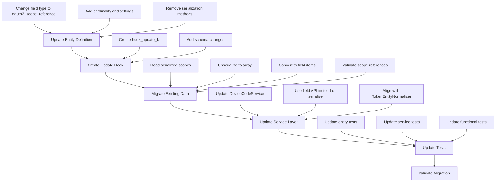
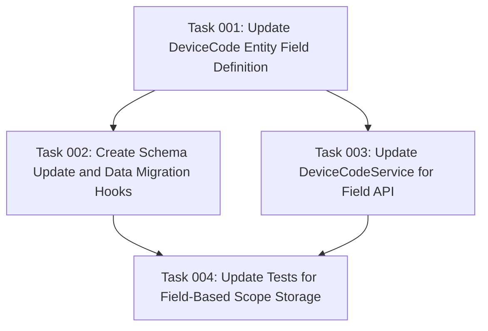

# Plan: Device Flow Scope Field Refactoring

## Original Work Order

> We need to correct the scope handling for Device Flow.
>
> No, this is NOT correct. The use of serialize() to store scopes is
> inconsistent with the simple_oauth module's established patterns and
> violates Drupal best practices.
>
> The Problem
>
> Looking at the code in /var/www/html/web/modules/contrib/simple_oauth_2
> 1/modules/simple_oauth_device_flow:
>
> DeviceCode entity (DeviceCode.php:105-113):
> $fields['scopes'] = BaseFieldDefinition::create('string_long')
> ->setLabel(t('Scopes'))
> ->setDescription(t('Serialized array of requested scopes.'))
>
> Then uses serialize() (DeviceCodeService.php:332):
> $device_code_entity->set('scopes', serialize($scope_array));
>
> How simple_oauth Does It
>
> The parent simple_oauth module uses a dedicated field type:
>
> Oauth2Token entity (src/Entity/Oauth2Token.php:123-137):
> $fields['scopes'] =
> BaseFieldDefinition::create('oauth2_scope_reference')
> ->setLabel(t('Scopes'))
> ->setDescription(t('The scopes for this Access Token.'))
> ->setCardinality(FieldStorageDefinitionInterface::CARDINALITY_UNLIMIT
> ED)
>
> TokenEntityNormalizer (src/Normalizer/TokenEntityNormalizer.php:42-45):
> $scopes = array_map(function (ScopeEntityInterface $scope_entity) {
> $scope_id = $scope_entity instanceof ScopeEntity ?
> $scope_entity->getScopeObject()->id() :
> $scope_entity->getIdentifier();
> return ['scope_id' => $scope_id];
> }, $token_entity->getScopes());
>
> Why serialize() is Wrong
>
> 1. Inconsistency: Violates the module's own patterns
> 2. No Database Queries: Can't query by scope in SQL
> 3. No Validation: Missing the oauth2_scope_reference field's built-in
>    validators
> 4. No Type Safety: Loses widgets, formatters, and proper field
>    integration
> 5. Security: unserialize() has known security implications (though
>    mitigated with ['allowed_classes' => FALSE] on line 352)
>
> Recommendation
>
> The DeviceCode entity should use
> BaseFieldDefinition::create('oauth2_scope_reference') instead of
> serializing to a string_long field. This would align with how access
> tokens, authorization codes, and other OAuth entities in simple_oauth
> store scopes.

## Executive Summary

This plan addresses a critical architectural inconsistency in the Device Flow module where scopes are stored using PHP's `serialize()` function in a `string_long` field, while the parent `simple_oauth` module uses a dedicated `oauth2_scope_reference` field type for all other OAuth entities (access tokens, authorization codes, etc.).

The refactoring will migrate the DeviceCode entity's scope storage from serialized strings to the `oauth2_scope_reference` field type, providing:

1. **Consistency**: Aligns with simple_oauth's established patterns
2. **Queryability**: Enables SQL queries by scope (critical for admin interfaces and reporting)
3. **Type Safety**: Leverages Drupal's field system with validation, widgets, and formatters
4. **Security**: Eliminates `unserialize()` usage
5. **Maintainability**: Reduces custom code and technical debt

This change requires database schema updates, entity definition modifications, and comprehensive testing to ensure backward compatibility and data integrity during migration.

## Context

### Current State

**Entity Definition Issues:**

- DeviceCode entity uses `BaseFieldDefinition::create('string_long')` for scopes field (DeviceCode.php:105-113)
- Scope data is serialized using `serialize($scope_array)` before storage (DeviceCodeService.php:332)
- Unserialization uses `unserialize($scopes_data, ['allowed_classes' => FALSE])` for retrieval (DeviceCode.php:352)
- Manual scope loading from storage using entity queries and ScopeEntity instantiation (DeviceCode.php:342-363)

**Database Schema:**

- Table `oauth2_device_code` has `scopes` column as `text` type (simple_oauth_device_flow.install:37-40)
- No relational structure for scope queries
- Cannot filter or join on individual scopes

**Code Patterns:**

- Custom `loadScopesFromDatabase()` and `saveScopesToDatabase()` methods (DeviceCode.php:348-377)
- Private `$scopeEntities` array property to cache scope objects (DeviceCode.php:49)
- Manual serialization/deserialization logic duplicated from simple_oauth patterns

### Target State

**Aligned Entity Definition:**

- DeviceCode entity will use `BaseFieldDefinition::create('oauth2_scope_reference')` matching Oauth2Token patterns
- Scope field will have `CARDINALITY_UNLIMITED` to support multiple scopes
- Field will include proper display options and widgets consistent with simple_oauth

**Proper Database Schema:**

- Multi-value scope storage using Drupal's field tables
- Ability to query device codes by scope
- Relational integrity for scope references

**Simplified Code:**

- Remove custom serialization methods (`loadScopesFromDatabase()`, `saveScopesToDatabase()`)
- Leverage Drupal's field API for all scope operations
- Eliminate manual scope entity instantiation
- Reduce private property caching in favor of field system

**Service Layer Updates:**

- DeviceCodeService will use field API methods instead of direct serialization
- Scope assignment will follow simple_oauth normalizer patterns
- Integration with existing oauth2_scope_reference validators

### Background

The Device Flow module (RFC 8628) was initially implemented with a quick-and-dirty serialization approach for scope storage, likely to minimize initial complexity. However, this creates:

1. **Architectural Debt**: Diverges from simple_oauth's field-based approach used in Oauth2Token, making the codebase inconsistent
2. **Feature Limitations**: Cannot build admin interfaces that filter/display device codes by scope
3. **Security Concerns**: While mitigated with `['allowed_classes' => FALSE]`, `unserialize()` has a history of vulnerabilities
4. **Testing Complexity**: Tests must work around serialization instead of using standard field assertions

The simple_oauth module provides the `oauth2_scope_reference` field type specifically for this purpose, with:

- `Oauth2ScopeReferenceItem` field type (src/Plugin/Field/FieldType/Oauth2ScopeReferenceItem.php)
- `Oauth2ScopeReferenceItemList` for multi-value handling (src/Plugin/Field/FieldType/Oauth2ScopeReferenceItemList.php)
- `Oauth2ScopeReferenceValidator` for validation (src/Plugin/Validation/Constraint/)
- Widget and formatter plugins for admin UI

## Technical Implementation Approach



### Component 1: Entity Definition Refactoring

**Objective**: Replace serialized scope storage with oauth2_scope_reference field type in DeviceCode entity

**Implementation Details:**

1. **Update `baseFieldDefinitions()` in DeviceCode.php (lines 105-113):**

   ```php
   $fields['scopes'] = BaseFieldDefinition::create('oauth2_scope_reference')
     ->setLabel(t('Scopes'))
     ->setDescription(t('The scopes for this Device Code.'))
     ->setCardinality(FieldStorageDefinitionInterface::CARDINALITY_UNLIMITED)
     ->setTranslatable(FALSE)
     ->setDisplayOptions('view', [
       'label' => 'inline',
       'type' => 'oauth2_scope_reference_label',
       'weight' => 4,
     ])
     ->setDisplayOptions('form', [
       'type' => 'oauth2_scope_reference',
       'weight' => 4,
     ]);
   ```

2. **Remove custom serialization methods:**
   - Delete `loadScopesFromDatabase()` (lines 348-366)
   - Delete `saveScopesToDatabase()` (lines 368-377)
   - Update `preSave()` to remove serialization logic (lines 382-394)

3. **Simplify scope getter/setter methods:**
   - `getScopes()` should use `$this->get('scopes')->getScopes()` instead of manual loading
   - `addScope()` should use field API: `$this->get('scopes')->appendItem(['scope_id' => $scope->getIdentifier()])`

4. **Remove private property:**
   - Delete `private array $scopeEntities = []` (line 49)
   - Rely on field storage instead of entity-level caching

**Key Considerations:**

- Must match the cardinality and structure of Oauth2Token's scopes field
- Display options ensure admin UI consistency
- Field API handles all validation automatically

### Component 2: Database Schema Migration

**Objective**: Create update hook to migrate existing serialized scope data to field tables

**Implementation Details:**

1. **Create `simple_oauth_device_flow_update_11001()` in .install file:**

   ```php
   function simple_oauth_device_flow_update_11001() {
     $entity_type_manager = \Drupal::entityTypeManager();
     $entity_definition_update_manager = \Drupal::entityDefinitionUpdateManager();

     // Get the updated field definition.
     $field_definition = BaseFieldDefinition::create('oauth2_scope_reference')
       ->setLabel(t('Scopes'))
       ->setDescription(t('The scopes for this Device Code.'))
       ->setCardinality(FieldStorageDefinitionInterface::CARDINALITY_UNLIMITED)
       ->setTranslatable(FALSE);

     // Install the new field storage definition.
     $entity_definition_update_manager->installFieldStorageDefinition(
       'scopes',
       'oauth2_device_code',
       'simple_oauth_device_flow',
       $field_definition
     );

     return t('Updated device code scopes field to use oauth2_scope_reference type.');
   }
   ```

2. **Create `simple_oauth_device_flow_update_11002()` for data migration:**

   ```php
   function simple_oauth_device_flow_update_11002(&$sandbox) {
     $storage = \Drupal::entityTypeManager()->getStorage('oauth2_device_code');

     if (!isset($sandbox['current'])) {
       $sandbox['current'] = 0;
       $sandbox['max'] = $storage->getQuery()->accessCheck(FALSE)->count()->execute();
     }

     // Process 50 device codes per batch.
     $device_codes = $storage->getQuery()
       ->accessCheck(FALSE)
       ->range($sandbox['current'], 50)
       ->execute();

     foreach ($storage->loadMultiple($device_codes) as $device_code) {
       // Read old serialized data.
       $connection = \Drupal::database();
       $serialized_scopes = $connection->select('oauth2_device_code', 'd')
         ->fields('d', ['scopes'])
         ->condition('device_code', $device_code->id())
         ->execute()
         ->fetchField();

       if ($serialized_scopes) {
         $scope_ids = unserialize($serialized_scopes, ['allowed_classes' => FALSE]);
         if (is_array($scope_ids)) {
           // Clear existing field values.
           $device_code->set('scopes', []);

           // Add each scope as a field item.
           foreach ($scope_ids as $scope_id) {
             $device_code->get('scopes')->appendItem(['scope_id' => $scope_id]);
           }

           $device_code->save();
         }
       }

       $sandbox['current']++;
     }

     $sandbox['#finished'] = $sandbox['current'] / $sandbox['max'];

     return t('Migrated @current of @max device code scope entries.', [
       '@current' => $sandbox['current'],
       '@max' => $sandbox['max'],
     ]);
   }
   ```

3. **Update hook_schema() to reflect field-based storage:**
   - Remove `'scopes'` from the main table schema (lines 37-40)
   - Field API will create separate field tables automatically

**Migration Strategy:**

- Use batch processing to handle large datasets
- Preserve all existing scope data during migration
- Validate scope references exist before assignment
- Log any migration errors for manual review

### Component 3: Service Layer Updates

**Objective**: Update DeviceCodeService to use field API instead of manual serialization

**Implementation Details:**

1. **Update `generateDeviceAuthorization()` in DeviceCodeService.php (lines 329-335):**

   ```php
   // Before:
   $scope_array = !empty($scope) ? explode(' ', trim($scope)) : [];
   $device_code_entity->set('scopes', serialize($scope_array));

   // After:
   $scope_array = !empty($scope) ? explode(' ', trim($scope)) : [];
   $device_code_entity->set('scopes', []);
   foreach ($scope_array as $scope_id) {
     $device_code_entity->get('scopes')->appendItem(['scope_id' => $scope_id]);
   }
   ```

2. **Update any code reading scopes:**

   ```php
   // Before:
   $scopes_data = $device_code->get('scopes')->value;
   $scope_identifiers = unserialize($scopes_data, ['allowed_classes' => FALSE]);

   // After:
   $scopes = $device_code->get('scopes')->getScopes();
   $scope_identifiers = array_map(function($scope) {
     return $scope->getIdentifier();
   }, $scopes);
   ```

3. **Align with simple_oauth patterns:**
   - Review TokenEntityNormalizer for scope handling patterns
   - Ensure consistency with how access tokens handle scopes
   - Use same field API methods throughout

**Code Quality:**

- Remove all `serialize()`/`unserialize()` calls
- Leverage field API's built-in validation
- Reduce custom code footprint

### Component 4: Test Updates

**Objective**: Update all tests to work with oauth2_scope_reference field instead of serialized data

**Implementation Details:**

1. **Update DeviceCodeEntityTest.php:**
   - Change scope assertions to use field API
   - Test multi-value scope assignment
   - Verify field validation works correctly

2. **Update DeviceFlowFunctionalTest.php:**
   - Ensure scope flow works end-to-end
   - Test device authorization with multiple scopes
   - Validate scope persistence and retrieval

3. **Update DeviceFlowIntegrationTest.php:**
   - Test integration with simple_oauth scope system
   - Verify scope validation constraints
   - Test scope-based queries if applicable

4. **Add migration test:**
   - Create test case for update hook 11002
   - Verify data integrity during migration
   - Test edge cases (empty scopes, invalid scopes, etc.)

**Test Coverage:**

- Field definition correctness
- Multi-value scope storage
- Scope validation
- Data migration integrity
- Backward compatibility

## Risk Considerations and Mitigation Strategies

### Technical Risks

- **Field Schema Mismatch**: oauth2_scope_reference field might have different storage structure than expected
  - **Mitigation**: Study Oauth2Token's scopes field implementation thoroughly; create test environment migration first; validate field schema before production deployment

- **Performance Degradation**: Multi-table field storage could slow down device code queries
  - **Mitigation**: Add database indexes on field tables; benchmark query performance before/after; consider denormalized caching if needed

- **Scope Reference Validation**: Invalid or missing scope IDs could cause migration failures
  - **Mitigation**: Add pre-migration validation step; log all invalid references; provide fallback to skip invalid scopes with warnings

### Implementation Risks

- **Data Loss During Migration**: Serialized data corruption could cause scope data loss
  - **Mitigation**: Create full database backup before migration; implement rollback mechanism; test migration on copy of production data; provide manual recovery documentation

- **Existing Device Codes**: Active device codes in production during deployment could be affected
  - **Mitigation**: Design update hooks to be rerunnable; implement batch processing with progress tracking; allow pausing/resuming migration; test with production-like data volumes

- **Test Coverage Gaps**: Existing tests might not cover all edge cases
  - **Mitigation**: Add comprehensive test coverage before refactoring; include migration-specific tests; perform manual QA on test environment; create rollback plan

### Integration Risks

- **Simple OAuth Compatibility**: Changes must remain compatible with simple_oauth's scope system
  - **Mitigation**: Run simple_oauth's own tests against modified code; verify no breaking changes to scope provider interfaces; consult simple_oauth documentation for field usage

- **Third-party Module Dependencies**: Other modules might interact with device codes
  - **Mitigation**: Search for any contrib modules that might query device code scopes; provide deprecation period if API changes are needed; document all breaking changes

## Success Criteria

### Primary Success Criteria

1. **Field Type Migration**: DeviceCode entity uses `oauth2_scope_reference` field type matching Oauth2Token's implementation
2. **Data Integrity**: All existing device code scopes are successfully migrated to new field structure with zero data loss
3. **Code Consistency**: No serialization code remains in DeviceCode entity or DeviceCodeService; all scope handling uses field API
4. **Test Coverage**: All existing tests pass with updated implementation; new tests verify field-based scope storage

### Quality Assurance Metrics

1. **Zero Test Failures**: All unit, kernel, and functional tests pass after refactoring
2. **Migration Success Rate**: 100% of device codes migrate successfully without errors (logged warnings for invalid scopes acceptable)
3. **Performance Baseline**: Query performance for device code operations remains within 10% of current baseline
4. **Code Quality**: PHPStan analysis passes at level 1 with zero errors; coding standards compliance maintained

## Resource Requirements

### Development Skills

- **Drupal Entity API**: Deep understanding of entity field definitions, field types, and field storage
- **Database Schema Management**: Knowledge of Drupal update hooks, field schema changes, and data migration patterns
- **Simple OAuth Architecture**: Familiarity with oauth2_scope_reference field type implementation
- **Testing Expertise**: Ability to write and update unit, kernel, and functional tests for entity changes

### Technical Infrastructure

- **Development Environment**: Local Drupal 11 installation with simple_oauth and simple_oauth_device_flow enabled
- **Database Backup/Restore**: Ability to create database snapshots for migration testing
- **PHPUnit**: For running existing and new test suites
- **PHPStan**: For static analysis validation
- **Test Dataset**: Sample device codes with various scope configurations for migration testing

## Integration Strategy

The refactoring integrates with the existing simple_oauth ecosystem by:

1. **Field Type Alignment**: Using the same `oauth2_scope_reference` field type as Oauth2Token ensures consistency across all OAuth entities
2. **Scope Provider Integration**: Leveraging the existing `simple_oauth.oauth2_scope.provider` service for scope loading and validation
3. **Normalizer Compatibility**: Following patterns from TokenEntityNormalizer ensures consistent scope handling across the module
4. **Widget/Formatter Support**: Admin interfaces will automatically gain scope selection widgets and display formatters

This approach ensures the Device Flow module becomes a first-class citizen within the simple_oauth architecture rather than a bolt-on with custom patterns.

## Implementation Order

1. **Field Definition Update**: Modify DeviceCode entity's baseFieldDefinitions() to use oauth2_scope_reference
2. **Update Hook Creation**: Write schema update and data migration hooks in .install file
3. **Service Layer Refactoring**: Update DeviceCodeService to use field API instead of serialization
4. **Entity Method Cleanup**: Remove custom serialization methods from DeviceCode entity
5. **Test Suite Updates**: Modify all tests to work with field-based scope storage
6. **Migration Testing**: Test update hooks on copy of production data
7. **Manual QA**: Verify device flow end-to-end with new field structure
8. **Documentation**: Update any developer documentation referencing scope storage

## Notes

**Backward Compatibility Considerations:**

- Update hooks provide automatic migration path for existing installations
- New installations will use oauth2_scope_reference from the start
- No API changes required for external code (getScopes() method signature unchanged)

**Future Enhancements Enabled:**

- Admin UI can now filter device codes by scope
- Views integration for device code reporting
- Scope-based access control becomes possible
- Consistent scope handling across all OAuth grant types

**Drupal Best Practices:**

- Field API is the recommended way to store multi-value entity data
- Avoiding custom serialization reduces security surface area
- Following simple_oauth patterns improves maintainability and reduces cognitive load for contributors

## Task Dependencies



## Execution Blueprint

**Validation Gates:**

- Reference: `.ai/task-manager/config/hooks/POST_PHASE.md`

### Phase 1: Entity Refactoring

**Parallel Tasks:**

- Task 001: Update DeviceCode Entity Field Definition

**Description:** Refactor the DeviceCode entity to use oauth2_scope_reference field type instead of serialized string storage.

### Phase 2: Schema and Service Updates

**Parallel Tasks:**

- Task 002: Create Schema Update and Data Migration Hooks (depends on: 001)
- Task 003: Update DeviceCodeService for Field API (depends on: 001)

**Description:** Update database schema with migration hooks and refactor service layer to use Field API, both building on the updated entity definition.

### Phase 3: Test Coverage

**Parallel Tasks:**

- Task 004: Update Tests for Field-Based Scope Storage (depends on: 002, 003)

**Description:** Update all existing tests and create new migration tests to ensure comprehensive coverage of the refactored implementation.

### Execution Summary

- Total Phases: 3
- Total Tasks: 4
- Maximum Parallelism: 2 tasks (in Phase 2)
- Critical Path Length: 3 phases
