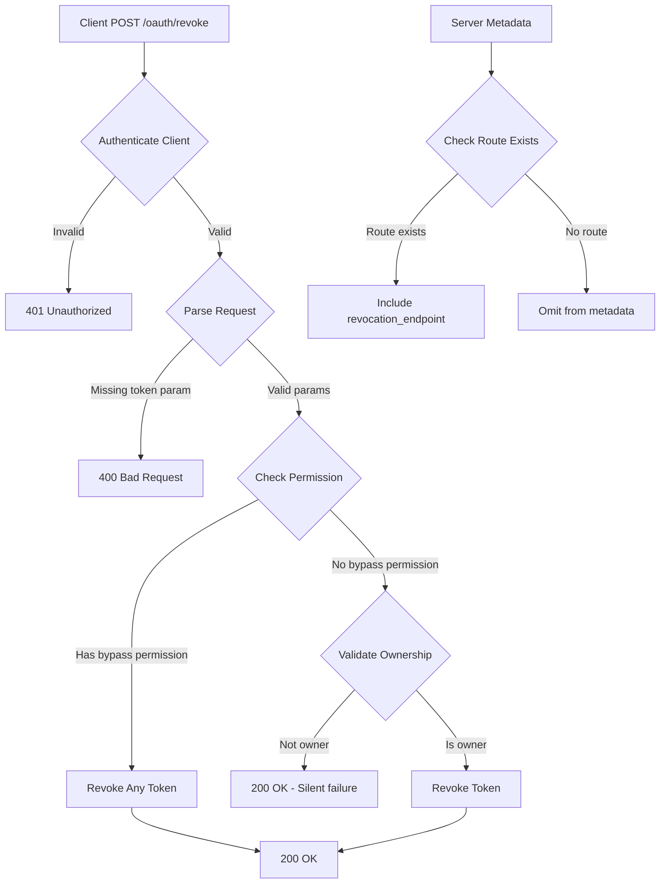

# Plan: RFC 7009 Token Revocation Endpoint

## Original Work Order

> I want to create a public revocation endpoint that is compliant with RFC 7009 for the OAuth specification. We already have the ability to revoke tokens as an internal PHP API. However, we are not exposing that as an endpoint that is compliant with the specification. Our task is to create this endpoint into the server metadata project similar to the plan that we have to include the introspection endpoint. This revocation endpoint should be secure and only accessible to the owner of the token or otherwise specified in the specification. For Drupal specifically, we want to also allow users with bypass token revocation restrictions permission to use this endpoint to revoke any token.
>
> Current state:
>
> Token Revocation (RFC 7009)
>
> Not implemented as a public endpoint. However:
>
> - The codebase has internal revocation functionality via the RevocableTokenRepositoryTrait with revoke() and isRevoked() methods (/var/www/html/web/modules/contrib/simple_oauth/src/Repositories/RevocableTokenRepositoryTrait.php:87-121)
> - This allows tokens to be marked as revoked in the database
> - There is NO public /oauth/revoke endpoint that clients can call
> - The server metadata module has a configurable field for revocation_endpoint (to advertise in server metadata), but the actual endpoint is not implemented
>
> The internal revocation functionality exists for administrative purposes (you can manually revoke tokens through the admin interface at /var/www/html/web/modules/contrib/simple_oauth/simple_oauth.routing.yml:27), but not through a standard RFC 7009 compliant client API.

## Executive Summary

This plan establishes a production-ready OAuth 2.0 token revocation endpoint compliant with RFC 7009 specifications. The implementation will expose existing internal revocation capabilities through a secure, standards-compliant public API endpoint at `/oauth/revoke`. The endpoint will integrate seamlessly with the existing Simple OAuth 2.1 module ecosystem, particularly the server metadata module, enabling automatic endpoint discovery through RFC 8414 server metadata responses.

The solution prioritizes security by implementing strict client authentication and token ownership validation, ensuring only authorized parties can revoke tokens. A permission-based bypass mechanism will allow privileged Drupal administrators to revoke any token, supporting administrative use cases while maintaining RFC compliance for standard OAuth clients.

This implementation completes a critical gap in the Simple OAuth 2.1 compliance dashboard, bringing the module ecosystem closer to full OAuth 2.1 and OpenID Connect certification readiness.

## Context

### Current State

The Simple OAuth module ecosystem currently lacks a public-facing token revocation endpoint, despite having robust internal revocation infrastructure:

**Existing Internal Infrastructure:**

- `RevocableTokenRepositoryTrait` (simple_oauth/src/Repositories/RevocableTokenRepositoryTrait.php:87-121) provides `revoke()` and `isRevoked()` methods for token lifecycle management
- Token entities support revocation status tracking in the database
- Administrative UI allows manual token deletion via `/admin/config/people/simple_oauth/oauth2_token/{oauth2_token}/delete`

**Server Metadata Module Configuration:**

- The `simple_oauth_server_metadata.settings` configuration schema includes a `revocation_endpoint` field (line 9-12 in schema)
- Configuration default value is empty string, indicating endpoint is not yet implemented
- No route exists at `/oauth/revoke` or any alternative path

**Security Gap:**

- OAuth clients cannot programmatically revoke compromised or expired tokens
- Refresh tokens cannot be invalidated when users log out
- No standardized mechanism exists for token cleanup in native mobile apps or SPAs

### Target State

A fully operational RFC 7009-compliant token revocation endpoint that:

1. **Exposes Public API:** Provides `/oauth/revoke` endpoint accepting POST requests with `token` and optional `token_type_hint` parameters
2. **Enforces Security:** Validates client authentication and token ownership before allowing revocation
3. **Integrates with Metadata:** Automatically advertises endpoint URL in server metadata responses at `/.well-known/oauth-authorization-server`
4. **Supports Administration:** Provides Drupal-specific permission (`bypass token revocation restrictions`) for administrative token management
5. **Maintains Compliance:** Returns appropriate HTTP status codes and error responses per RFC 7009 specifications
6. **Enables Testing:** Includes comprehensive test coverage (unit, kernel, functional) following project standards

### Background

**RFC 7009 Requirements:**

- MUST accept POST requests to revocation endpoint
- MUST require client authentication (confidential clients provide credentials, public clients provide client_id)
- MUST validate that requesting client owns the token being revoked
- SHOULD respond with HTTP 200 whether token was valid or not (prevents information disclosure)
- MUST support `token` parameter (required) and `token_type_hint` parameter (optional: "access_token" or "refresh_token")
- MAY support `unsupported_token_type` error response

**Architectural Constraints:**

- Must reside in the `simple_oauth_server_metadata` module (not the core `simple_oauth` module) to maintain separation of concerns
- Must follow existing controller patterns seen in `Oauth2Token` controller
- Must integrate with existing `ServerMetadataService` to advertise endpoint location
- Must use dependency injection for all services (no static calls or service locators)

**Design Decisions:**

- The endpoint will be implemented as a standalone controller rather than extending League OAuth2 Server libraries, since token revocation is a simple database operation and doesn't require the full OAuth server infrastructure
- Client authentication will be handled through a dedicated service that validates credentials against the Consumer entity repository
- The Drupal-specific bypass permission extends RFC 7009 in a non-breaking way, allowing administrative workflows while maintaining standard OAuth behavior for regular clients

## Technical Implementation Approach



### Component 1: Token Revocation Controller

**Objective:** Create the primary HTTP endpoint handler that processes revocation requests and enforces security policies.

**Location:** `simple_oauth_server_metadata/src/Controller/TokenRevocationController.php`

**Key Responsibilities:**

1. **Request Validation:** Extract and validate `token` (required) and `token_type_hint` (optional) from POST body
2. **Client Authentication:** Delegate to authentication service to verify client credentials from Authorization header or POST body
3. **Ownership Verification:** Ensure requesting client owns the token, unless user has bypass permission
4. **Token Revocation:** Call existing `RevocableTokenRepositoryTrait::revoke()` method to mark token as revoked
5. **Response Generation:** Return HTTP 200 with empty body for success, appropriate error codes for failures

**Implementation Specifications:**

- Use `final class` declaration with `ControllerBase` extension
- Inject `ClientAuthenticationService`, `EntityTypeManagerInterface`, and `CurrentUserInterface` via constructor
- Support both access tokens and refresh tokens through unified revocation logic
- Implement silent success for already-revoked or non-existent tokens (per RFC 7009 privacy considerations)
- Log revocation attempts for audit trails using `logger.channel.simple_oauth`

**Error Handling:**

- `400 Bad Request` - Missing required `token` parameter
- `401 Unauthorized` - Invalid or missing client credentials
- `503 Service Unavailable` - Database or service temporarily unavailable (allows client retry)

### Component 2: Client Authentication Service

**Objective:** Provide reusable client credential validation logic that can be shared across multiple endpoints (revocation, introspection, etc.).

**Location:** `simple_oauth_server_metadata/src/Service/ClientAuthenticationService.php`

**Key Responsibilities:**

1. **Credential Extraction:** Parse credentials from HTTP Basic Auth header or POST body parameters (`client_id`, `client_secret`)
2. **Client Lookup:** Query Consumer entity repository to find matching client
3. **Secret Validation:** Verify client_secret using secure comparison (constant-time to prevent timing attacks)
4. **Public Client Handling:** Support public clients (no secret) by validating client_id only
5. **Result Normalization:** Return standardized success/failure result with client entity on success

**Implementation Specifications:**

- Use `final class` declaration with dependency injection
- Inject `ClientRepositoryInterface` from `simple_oauth.repositories.client` service
- Implement `authenticateClient(ServerRequestInterface $request): ?ConsumerInterface` method
- Use `hash_equals()` or Drupal's `Crypt::hashEquals()` for secret comparison
- Support both Authorization header (RFC 6749 Section 2.3.1) and request body authentication

**Security Considerations:**

- Never log client secrets or expose them in error messages
- Implement rate limiting considerations (document need for future enhancement)
- Validate client is not revoked or disabled before accepting credentials

### Component 3: Routing and Permission Configuration

**Objective:** Define the `/oauth/revoke` route and establish permission structure for access control.

**Files Modified:**

- `simple_oauth_server_metadata/simple_oauth_server_metadata.routing.yml`
- `simple_oauth_server_metadata/simple_oauth_server_metadata.permissions.yml` (new file)

**Route Specification:**

```yaml
simple_oauth_server_metadata.revoke:
  path: '/oauth/revoke'
  defaults:
    _controller: 'Drupal\simple_oauth_server_metadata\Controller\TokenRevocationController::revoke'
    _title: 'OAuth 2.0 Token Revocation'
  methods: [POST]
  requirements:
    _access: 'TRUE'
```

**Permission Definition:**

```yaml
bypass token revocation restrictions:
  title: 'Bypass token revocation restrictions'
  description: 'Allows revoking any OAuth token regardless of ownership'
  restrict access: TRUE
```

**Access Control Logic:**

- Base endpoint access is public (`_access: 'TRUE'`) since authentication happens within the controller
- Bypass permission checked within controller logic using `CurrentUserInterface::hasPermission()`
- Permission restricted to administrative roles by default through `restrict access: TRUE`

### Component 4: Server Metadata Integration

**Objective:** Automatically advertise the revocation endpoint in server metadata responses when the endpoint is available.

**Files Modified:**

- `simple_oauth_server_metadata/src/Service/EndpointDiscoveryService.php`

**Integration Approach:**

1. **Route Discovery:** Use `RouteProviderInterface` to check if `simple_oauth_server_metadata.revoke` route exists
2. **URL Generation:** Generate absolute URL using `Url::fromRoute('simple_oauth_server_metadata.revoke', [], ['absolute' => TRUE])`
3. **Metadata Inclusion:** Return endpoint URL in `getCoreEndpoints()` method under `revocation_endpoint` key
4. **Fallback Logic:** If route doesn't exist or URL generation fails, fall back to configured value from `simple_oauth_server_metadata.settings.revocation_endpoint`

**Benefits:**

- Zero-configuration endpoint discovery for OAuth clients
- Automatic availability signaling in `/.well-known/oauth-authorization-server` responses
- Consistent with existing endpoint discovery patterns (authorization_endpoint, token_endpoint, etc.)

### Component 5: Token Repository Service

**Objective:** Create a dedicated service that wraps token repository access for revocation operations, providing a clean abstraction layer.

**Location:** `simple_oauth_server_metadata/src/Service/TokenRevocationService.php`

**Key Responsibilities:**

1. **Token Lookup:** Find token entity by token value (hash lookup)
2. **Ownership Validation:** Verify token belongs to specified client_id
3. **Revocation Execution:** Call `revoke()` method on token entity
4. **Type Handling:** Support both access tokens and refresh tokens
5. **Status Reporting:** Return boolean success indicator

**Implementation Specifications:**

```php
public function revokeToken(string $token_value, string $client_id, bool $bypass_ownership = FALSE): bool
```

**Benefits:**

- Encapsulates token repository complexity
- Provides reusable service for future introspection endpoint
- Simplifies controller logic and improves testability
- Centralizes ownership validation logic

### Component 6: Comprehensive Test Coverage

**Objective:** Ensure endpoint reliability and RFC compliance through multi-layered testing strategy.

**Test Suite Structure:**

**Unit Tests** (`tests/src/Unit/Service/ClientAuthenticationServiceTest.php`):

- Mock-based testing of client authentication logic
- Credential extraction scenarios (Basic Auth, POST body, public clients)
- Secret validation using test credentials
- Edge cases (missing credentials, malformed headers, etc.)

**Kernel Tests** (`tests/src/Kernel/Service/TokenRevocationServiceKernelTest.php`):

- Token creation and revocation with minimal Drupal bootstrap
- Database interaction verification
- Ownership validation logic
- Token type handling (access vs. refresh tokens)

**Functional Tests** (`tests/src/Functional/TokenRevocationEndpointTest.php`):

- Full HTTP request/response cycle testing
- End-to-end revocation workflows
- Client authentication scenarios
- Permission-based access control (bypass permission tests)
- Error response validation (400, 401, 503)
- RFC 7009 compliance verification
- Server metadata inclusion verification

**Test Coverage Goals:**

- 100% code coverage for new controller and services
- All RFC 7009 required behaviors validated
- All error paths exercised
- Security controls verified (ownership validation, permission checks)

## Risk Considerations and Mitigation Strategies

### Technical Risks

- **Client Secret Exposure:** Logging or error messages could accidentally expose client secrets
  - **Mitigation:** Implement strict filtering in logger, use generic error messages, code review focused on secret handling

- **Timing Attack Vulnerability:** Non-constant-time secret comparison could leak information
  - **Mitigation:** Use `hash_equals()` or `Crypt::hashEquals()` for all secret comparisons, security review of authentication service

- **Token Enumeration:** Error responses could reveal whether tokens exist
  - **Mitigation:** Always return HTTP 200 for revocation requests (whether token exists or not) per RFC 7009 privacy guidelines

- **Database Performance:** High-volume revocation requests could impact database
  - **Mitigation:** Token lookup uses indexed `value` field, consider adding caching layer in future enhancement

### Implementation Risks

- **Breaking Changes to Existing Admin UI:** Adding permissions could affect existing admin workflows
  - **Mitigation:** New bypass permission is additive only, doesn't modify existing admin interface permissions

- **Integration with Existing Services:** Client authentication service must align with existing OAuth flows
  - **Mitigation:** Reuse existing `ClientRepositoryInterface` from simple_oauth module, follow established patterns from `Oauth2Token` controller

- **Module Dependency Complexity:** Adding features to server metadata module increases coupling
  - **Mitigation:** Keep implementation self-contained within server metadata module, use service interfaces for cross-module communication

### Security Risks

- **Unauthorized Token Revocation:** Malicious clients revoking other clients' tokens
  - **Mitigation:** Strict ownership validation before revocation (except for bypass permission), comprehensive security testing

- **Denial of Service:** Repeated revocation requests overwhelming the system
  - **Mitigation:** Document need for rate limiting, log excessive requests for monitoring, consider flood control in future iteration

- **Information Disclosure:** Error messages revealing internal system details
  - **Mitigation:** Use generic error messages, avoid stack traces in production, security-focused code review

### Quality Risks

- **RFC Non-Compliance:** Implementation deviating from RFC 7009 specifications
  - **Mitigation:** Line-by-line RFC validation during implementation, functional tests covering all RFC requirements, external OAuth compliance testing

- **Regression in Existing Functionality:** Changes affecting existing token management
  - **Mitigation:** Comprehensive test suite for existing features, no modifications to core simple_oauth module

## Success Criteria

### Primary Success Criteria

1. **Functional Endpoint:** `/oauth/revoke` endpoint accepts POST requests and successfully revokes tokens when provided with valid client credentials and token values
2. **RFC Compliance:** Endpoint behavior fully complies with RFC 7009 specifications including request/response formats, error codes, and security requirements
3. **Security Enforcement:** Only token owners or users with bypass permission can revoke tokens, with all authentication and authorization checks functioning correctly
4. **Metadata Integration:** Revocation endpoint URL appears in server metadata responses at `/.well-known/oauth-authorization-server` when endpoint is enabled
5. **Test Coverage:** All new code passes unit, kernel, and functional tests with 100% code coverage

### Quality Assurance Metrics

1. **PHPStan Level 1:** All new code passes static analysis with zero errors
2. **Drupal Coding Standards:** All code follows Drupal and DrupalPractice standards (PHPCS validation)
3. **Documentation:** All classes, methods, and properties have comprehensive PHPDoc comments with type hints and parameter descriptions
4. **Performance:** Revocation requests complete in under 200ms under normal load conditions
5. **Error Handling:** All error scenarios return appropriate HTTP status codes with helpful (but secure) error messages

## Resource Requirements

### Development Skills

- **PHP 8.3+:** Modern PHP features including typed properties, constructor property promotion, readonly properties
- **Drupal 11 Architecture:** Deep understanding of service container, dependency injection, entity API, routing system
- **OAuth 2.0 Specifications:** Working knowledge of RFC 7009 (Token Revocation), RFC 6749 (OAuth 2.0), RFC 8414 (Server Metadata)
- **Security Best Practices:** Credential validation, timing attack prevention, information disclosure risks, secure logging
- **PHPUnit Testing:** Unit testing with mocks, kernel testing with database, functional testing with HTTP requests

### Technical Infrastructure

- **Simple OAuth Module:** Core OAuth implementation providing token repositories and client repositories
- **PSR-7 HTTP Messages:** `symfony/psr-http-message-bridge` for converting Symfony requests to PSR-7
- **League OAuth2 Server:** Client repository interfaces (already available via simple_oauth module)
- **Drupal Core Services:** Entity Type Manager, Current User, Route Provider, URL Generator, Config Factory, Logger
- **Testing Framework:** PHPUnit with Drupal test traits (BrowserTestBase, KernelTestBase, UnitTestCase)

### Development Dependencies

- **Existing Services:** `simple_oauth.repositories.client`, `entity_type.manager`, `current_user`, `logger.channel.simple_oauth`
- **New Services:** Client authentication service, token revocation service (to be implemented)
- **Configuration Schema:** Updates to `simple_oauth_server_metadata.schema.yml` (already has revocation_endpoint field)

## Implementation Order

The implementation follows a bottom-up dependency order to ensure each component can be tested independently:

1. **Service Layer First:** Build token revocation service and client authentication service with comprehensive unit tests
2. **Controller Implementation:** Create revocation controller using tested services, add kernel tests
3. **Routing and Permissions:** Define routes and permissions, integrate with server metadata discovery
4. **Functional Testing:** Add end-to-end tests covering all RFC 7009 scenarios
5. **Integration and Documentation:** Update server metadata service, add configuration documentation

This order minimizes integration issues and allows for incremental validation of each component.

## Notes

**Future Enhancements Considered but Deferred:**

- **Rate Limiting:** Token revocation endpoint should eventually implement rate limiting to prevent abuse. This can be added in a future iteration using Drupal's flood control or custom throttling service.

- **Revocation Event System:** Consider dispatching events when tokens are revoked to allow other modules to react (e.g., clearing caches, notifying users, logging to external systems).

- **Bulk Revocation:** Administrative interface for bulk token revocation could leverage the same backend service.

- **Token Introspection Endpoint:** RFC 7662 token introspection endpoint would reuse much of the same infrastructure (client authentication, token lookup). This should be a separate plan but can share the `ClientAuthenticationService`.

**OAuth 2.1 Compliance Status:**

This implementation addresses one of the required features for OAuth 2.1 compliance. The Simple OAuth 2.1 compliance dashboard should be updated to reflect the availability of the token revocation endpoint once this plan is complete.

**Relationship to Existing Plans:**

The token introspection endpoint (mentioned in the work order) is not yet implemented but would follow a very similar architectural pattern. Consider creating a parallel plan for introspection that can reuse the client authentication service built for this revocation endpoint.
