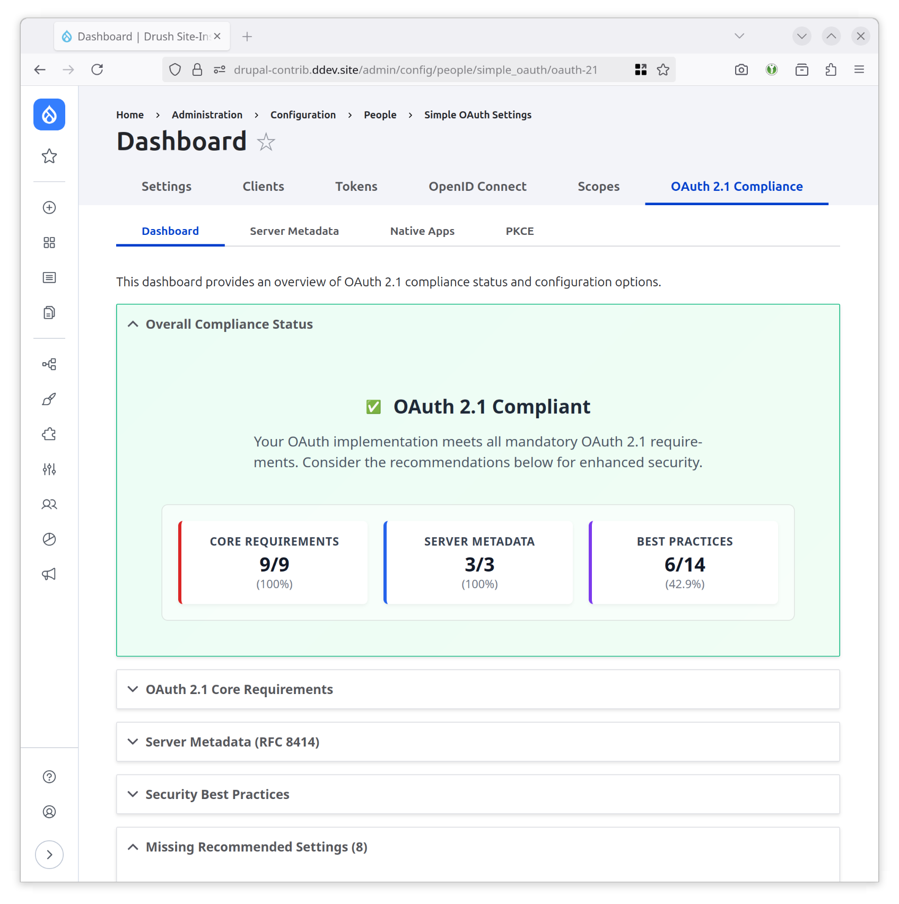

# Simple OAuth 2.1

A comprehensive OAuth 2.1 compliance module that provides centralized coordination and assessment of OAuth 2.1 implementation across Drupal's OAuth ecosystem.

## Overview



The Simple OAuth 2.1 module serves as an umbrella coordination module that ensures OAuth 2.1 compliance through integration with specialized submodules. It provides a professional compliance dashboard that monitors and assesses OAuth 2.1 implementation status in real-time.

### OAuth 2.1 Compliance

OAuth 2.1 represents the next evolution of the OAuth 2.0 standard, consolidating security best practices and eliminating deprecated flows. This module coordinates compliance with:

- **Mandatory PKCE**: Proof Key for Code Exchange for all authorization code flows
- **Enhanced Security**: Elimination of deprecated implicit grant flow
- **Native App Security**: RFC 8252 compliance for mobile and desktop applications
- **Server Metadata**: RFC 8414 automatic discovery capabilities

## Features

### Compliance Dashboard

Access the comprehensive compliance dashboard at:
**Administration → Configuration → People → Simple OAuth → OAuth 2.1 Dashboard**

The dashboard provides:

- **Overall Compliance Status**: Visual assessment with clear compliance indicators
- **Score Breakdown**: Detailed scoring across three categories:
  - **Core Requirements** (Mandatory): Essential OAuth 2.1 compliance features
  - **Server Metadata** (Required): RFC 8414 discovery and metadata
  - **Best Practices** (Recommended): Additional security enhancements
- **Critical Issues**: Identification of mandatory requirements that block compliance
- **Actionable Recommendations**: Direct links to configuration pages for missing features
- **Real-time Assessment**: Dynamic compliance monitoring with cache management

### Intelligent Module Detection

The module supports flexible deployment patterns:

- **Submodule Installation**: Integrated submodules within the simple_oauth_21 package
- **Standalone Modules**: Individual contrib modules (simple_oauth_pkce, etc.)
- **Mixed Environments**: Combination of submodules and standalone installations
- **Graceful Degradation**: Partial compliance assessment when modules are missing

### Professional Interface

- **Responsive Design**: Mobile-friendly dashboard with accessibility support
- **Visual Indicators**: Clear status icons and color-coded compliance levels
- **Configuration Links**: Direct navigation to relevant settings pages
- **Error Recovery**: Graceful handling of service failures with detailed diagnostics

## Submodules

The Simple OAuth 2.1 ecosystem consists of specialized submodules:

### simple_oauth_pkce

Implements RFC 7636 PKCE (Proof Key for Code Exchange) for OAuth 2.1 compliance.

- Mandatory S256 challenge method support
- Configurable enforcement levels
- Authorization code interception protection

### simple_oauth_native_apps

Provides RFC 8252 native application security enhancements.

- WebView detection and blocking
- Custom URI schemes and loopback redirects
- Enhanced PKCE requirements for native clients
- Exact redirect URI matching

### simple_oauth_server_metadata

Implements RFC 8414 Authorization Server Metadata for automatic discovery.

- `/.well-known/oauth-authorization-server` endpoint
- Capability advertisement and automatic client configuration
- Support for extended metadata fields

## Installation

### Requirements

- Drupal 9.0+ or Drupal 10.0+
- Simple OAuth module (contrib or core)
- PHP 8.1+

### Installation via Composer

```bash
composer require drupal/simple_oauth_21
```

### Enable Modules

Enable the umbrella module and desired submodules:

```bash
# Enable the main coordination module
drush pm:enable simple_oauth_21

# Enable OAuth 2.1 compliance submodules
drush pm:enable simple_oauth_pkce
drush pm:enable simple_oauth_native_apps
drush pm:enable simple_oauth_server_metadata
```

## Configuration

### Basic Setup

1. **Enable Required Modules**: Install simple_oauth_21 and at least simple_oauth_pkce for basic OAuth 2.1 compliance
2. **Access Dashboard**: Navigate to `/admin/config/people/simple_oauth/oauth-21`
3. **Review Compliance**: Check overall compliance status and address critical issues
4. **Configure Submodules**: Use dashboard links to configure individual submodules

### Compliance Levels

**Fully Compliant**: All mandatory and required features enabled

- PKCE with S256 challenge method
- Implicit grant disabled
- Server metadata endpoint active
- All critical security features enabled

**Mostly Compliant**: Core requirements met with minor recommendations

- Essential OAuth 2.1 features active
- Some recommended features may be missing

**Partially Compliant**: Basic functionality with compliance gaps

- Some mandatory features missing
- Security vulnerabilities may exist

**Non-Compliant**: Critical OAuth 2.1 requirements missing

- PKCE not enabled or improperly configured
- Deprecated flows still active
- Security requirements not met

### Permissions

- **administer simple_oauth entities**: Required to access the compliance dashboard
- Individual submodules may have additional permission requirements

## OAuth 2.1 Implementation Guide

### Step 1: Core Requirements

1. Enable `simple_oauth_pkce` module
2. Configure PKCE enforcement to "mandatory"
3. Enable S256 challenge method
4. Disable plain challenge method (production)
5. Verify implicit grant is disabled

### Step 2: Server Metadata (Recommended)

1. Enable `simple_oauth_server_metadata` module
2. Configure optional endpoints (revocation, introspection)
3. Add service documentation URLs
4. Test `/.well-known/oauth-authorization-server` endpoint

### Step 3: Native App Security (If Applicable)

1. Enable `simple_oauth_native_apps` module
2. Configure WebView detection policy
3. Enable custom URI schemes
4. Enable loopback redirects
5. Enable exact redirect URI matching

### Step 4: Verification

1. Access compliance dashboard
2. Verify "Fully Compliant" status
3. Address any remaining recommendations
4. Test OAuth flows with real clients

## Performance Considerations

### Caching

- Compliance assessments are cached for performance
- Cache automatically invalidates on configuration changes
- Manual cache clearing: `drush cache:rebuild`

### Database Impact

- Minimal database overhead
- Configuration stored in standard Drupal config system
- No custom tables required

### Production Recommendations

- Enable all recommended modules for full compliance
- Monitor compliance dashboard regularly
- Implement proper logging and monitoring
- Consider CDN for metadata endpoints

## Security Considerations

### OAuth 2.1 Security Benefits

- **PKCE Protection**: Prevents authorization code interception
- **Implicit Flow Elimination**: Removes token exposure in browser history
- **Enhanced Native Security**: Protects mobile and desktop applications
- **Automatic Discovery**: Reduces configuration errors

### Production Security Checklist

- [ ] PKCE enforcement set to "mandatory"
- [ ] S256 challenge method enabled
- [ ] Plain challenge method disabled
- [ ] WebView detection enabled (if using native apps)
- [ ] HTTPS enforced for all OAuth endpoints
- [ ] Implicit grant disabled
- [ ] Regular compliance monitoring

## Troubleshooting

### Common Issues

**Q: Dashboard shows "Non-Compliant" despite enabling submodules**
A: Clear the compliance cache by disabling/re-enabling modules or clearing Drupal caches.

**Q: Configuration changes not reflected in dashboard**
A: Configuration changes trigger automatic cache invalidation. Try clearing all caches if issues persist.

**Q: Module compatibility issues**
A: Ensure all modules are updated to compatible versions. Check module dependencies.

**Q: Performance issues with compliance checking**
A: Verify that caching is enabled and consider increasing cache lifetime for stable configurations.

### Debug Mode

Enable detailed logging by setting the log level to DEBUG for the 'simple_oauth_21' channel:

```php
\Drupal::logger('simple_oauth_21')->debug('Debug message');
```

## Standards Compliance

This module implements the following standards:

- **OAuth 2.1 Draft**: Core specification compliance
- **RFC 7636**: PKCE implementation and coordination
- **RFC 8252**: Native application security coordination
- **RFC 8414**: Server metadata compliance monitoring

## Testing

### Automated Testing

The module includes comprehensive test suites:

- **Unit Tests**: Service logic and configuration validation
- **Kernel Tests**: Integration testing with Drupal core
- **Functional Tests**: End-to-end compliance verification
- **Browser Tests**: Dashboard functionality and user interface

### Manual Testing

1. **Compliance Verification**: Use dashboard to verify complete compliance
2. **Configuration Testing**: Test all submodule configuration combinations
3. **Client Integration**: Test with real OAuth clients
4. **Security Testing**: Verify all security requirements

## Contributing

This module follows Drupal coding standards and contribution guidelines:

- Code should follow Drupal Coding Standards
- All changes should include appropriate tests
- Security-related changes require thorough review
- Documentation should be updated for feature changes

## Support

- **Issue Queue**: https://www.drupal.org/project/issues/simple_oauth_21
- **Documentation**: https://www.drupal.org/docs/contributed-modules/simple-oauth-21
- **Security Issues**: Follow Drupal security reporting procedures

## License

GPL-2.0+
